# 🏦 **Deep Technical Answers for Backend Engineer - JPMorgan**

I'll provide comprehensive, interview-ready answers with diagrams for each key area.

---

## 🎯 **Core Java & JVM**

### Q1: How does HashMap work internally? What's the time complexity?

```mermaid
graph TD
    A[Key: "apple"] --> B[hashCode: 12345]
    B --> C[Index: 12345 % 16 = 9]
    C --> D[Array Index 9]
    D --> E{Is bucket empty?}
    E -->|Yes| F[Create Node]
    E -->|No| G[Check existing keys]
    G --> H{Keys equal?}
    H -->|Yes| I[Replace value]
    H -->|No| J[Add to linked list / tree]
```

**Deep Answer:**

HashMap works on the principle of **hashing** with an underlying array of `Node<K,V>` called **buckets**.

**Internal Structure:**
- Default initial capacity: **16** buckets
- Default load factor: **0.75**
- Threshold = capacity * load factor (16 * 0.75 = 12)

**Put Operation:**
1. `hashCode()` is called on the key
2. Hash is perturbed: `h = key.hashCode() ^ (h >>> 16)` to distribute bits
3. Index = `(n - 1) & hash` (where n is array length)
4. At calculated index:
   - If empty → create node
   - If collision occurs → traverse linked list (or tree)
   - Check equality using `equals()` and `==`
   - If key exists → replace value
   - If new key → add to chain

**Java 8+ Optimization:**
- When collision count > 8 **AND** total buckets > 64, linked list → **Red-Black Tree** (O(n) → O(log n))
- When tree size < 6, converts back to linked list

**Time Complexity:**
- Best case (no collisions): **O(1)**
- Worst case (all keys same bucket, before treeify): **O(n)**
- After treeify: **O(log n)**

**Thread Safety:**
- Not thread-safe! Concurrent modification can cause:
  - Infinite loops (pre-Java 8)
  - Data corruption
  - `ConcurrentModificationException`

**Memory:**
- Each node stores: hash, key, value, next pointer (~32-48 bytes per entry)

---

### Q2: Explain ConcurrentHashMap vs Collections.synchronizedMap()

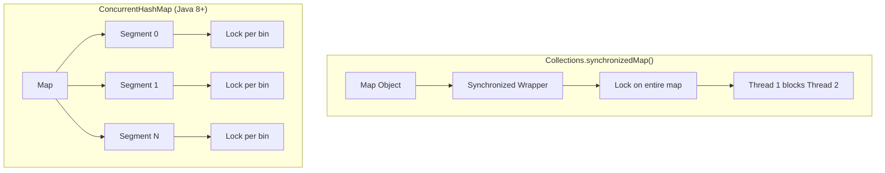

**Deep Answer:**

| Feature | Collections.synchronizedMap() | ConcurrentHashMap |
|---------|------------------------------|-------------------|
| **Locking** | Entire map locked | Bucket-level (CAS + synchronized) |
| **Concurrent Reads** | Blocks (shared lock) | Fully concurrent, no blocking |
| **Concurrent Writes** | One at a time | Different buckets can write simultaneously |
| **Iterator** | Fail-fast (throws ConcurrentModificationException) | Weakly consistent (doesn't throw) |
| **Null keys/values** | Allowed | Not allowed |
| **Performance** | Degrades with contention | Scales linearly with cores |

**ConcurrentHashMap Internals (Java 8+):**

**Data Structure:**
- Array of `Node<K,V>` (similar to HashMap)
- `transient volatile Node<K,V>[] table;`

**Put Operation:**
```java
final V putVal(K key, V value, boolean onlyIfAbsent) {
    // 1. No null keys/values
    // 2. Spread hash
    // 3. CAS operations for initialization
    // 4. synchronized on specific bin for collision
}
```

**Key Mechanisms:**
- **CAS (Compare-And-Swap)** for lock-free operations
- **volatile** reads for visibility
- **synchronized** only on specific bins during write collisions
- **size()** uses CounterCells to avoid contention

**Size Calculation:**
- Maintains `baseCount` + array of `CounterCell`
- Updates use CAS to avoid contention
- Sum of all counters gives approximate size

**Resizing:**
- **Multi-threaded resize** - multiple threads help copy buckets
- **ForwardingNode** marks migrated buckets
- **Transfer** operation allows concurrent reads during resize

**Memory Overhead:**
- Slightly higher than HashMap due to concurrency control
- CounterCell array adds minimal overhead

---

### Q3: How does Garbage Collection work in Java? Different GC algorithms

```mermaid
graph TD
    subgraph "JVM Memory"
        Y[Young Generation] --> Eden
        Y --> S0[Survivor Space 0]
        Y --> S1[Survivor Space 1]
        O[Old Generation] --> Tenured
        M[Metaspace] --> Class Metadata
    end
    
    subgraph "GC Algorithms"
        A[Serial] -->|Single Thread| P[Stop-the-World]
        B[Parallel] -->|Multiple Threads| P
        C[CMS] -->|Concurrent Mark Sweep| Q[Low Pause]
        D[G1] -->|Region-based| R[Predictable Pauses]
        E[ZGC] -->|Colored Pointers| S[<10ms Pause]
    end
```

**Deep Answer:**

**Memory Generation:**
1. **Young Generation** (Eden + Survivor S0/S1)
   - New objects allocated here
   - Minor GC occurs when Eden fills
   - Objects promoted after surviving multiple GCs

2. **Old Generation** (Tenured)
   - Long-lived objects
   - Major GC occurs here

3. **Metaspace** (Java 8+ replaces PermGen)
   - Class metadata, method data
   - Native memory (not heap)

**GC Algorithms:**

**1. Serial GC**
```
Young: Mark-Copy
Old: Mark-Sweep-Compact
Pros: Simple, low overhead
Cons: Stop-the-world, single thread
Use case: Single-threaded apps, small heaps
```

**2. Parallel GC (Default in Java 8)**
```
Multiple threads for young collection
Parallel compaction in old generation
Flag: -XX:+UseParallelGC
Throughput-oriented
Pause times increase with heap size
```

**3. CMS (Concurrent Mark Sweep) - Deprecated in Java 14**
```
Initial Mark (STW) → Concurrent Mark → Remark (STW) → Concurrent Sweep
Pros: Low pause times
Cons: Fragmentation, CPU overhead
Flags: -XX:+UseConcMarkSweepGC
```

**4. G1 (Garbage First) - Default in Java 9+**
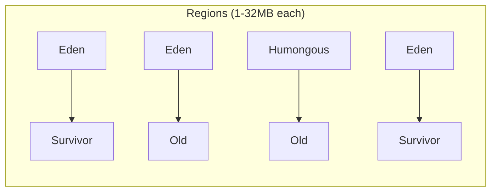

**How G1 works:**
- Heap divided into **regions** (1-32MB)
- **Concurrent global marking** identifies live objects
- **Mixed collections** collect young + old regions
- **Predictable pause times** by selecting regions to collect
- **Remembered Sets** track cross-region references

**Flags:**
```bash
-XX:+UseG1GC
-XX:MaxGCPauseMillis=200
-XX:G1HeapRegionSize=16m
```

**5. ZGC (Java 15+) - Ultra-low latency**
- Colored pointers (metadata in unused address bits)
- Load barriers instead of stop-the-world
- Sub-millisecond pause times (<10ms)
- Handles multi-terabyte heaps

**GC Selection Guide:**

| Requirement | GC Choice |
|-------------|-----------|
| Throughput | Parallel |
| Low latency (<100ms) | G1 |
| Ultra-low latency (<10ms) | ZGC/Shenandoah |
| Small heap (<4GB) | Serial/Parallel |
| Large heap (>100GB) | G1/ZGC |

**GC Tuning:**
```bash
# Verbose GC logging
-XX:+PrintGCDetails
-XX:+PrintGCDateStamps
-Xloggc:gc.log

# Heap sizing
-Xms4g -Xmx4g
-XX:NewRatio=2  # Old:Young = 2:1
-XX:SurvivorRatio=8  # Eden:Survivor = 8:1
```

---

### Q4: How do you handle thread dumps to debug production issues?

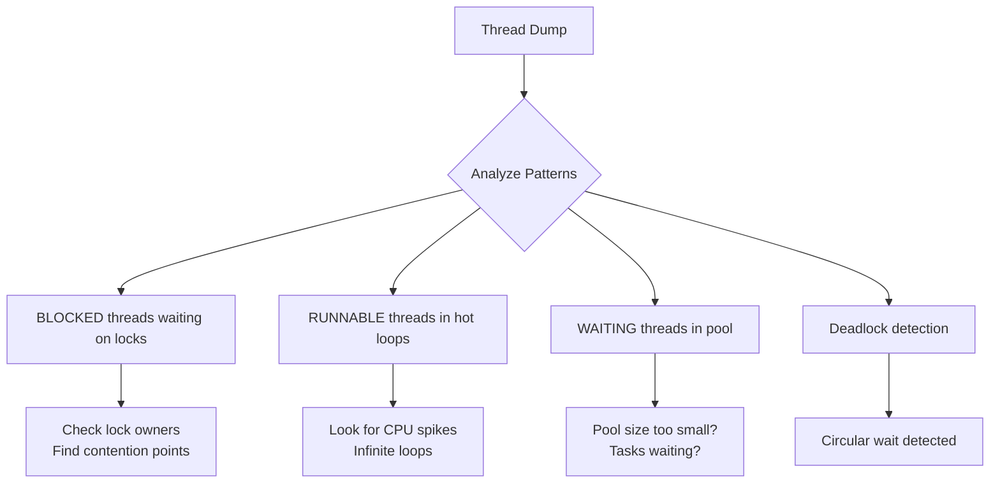

**Deep Answer:**

**Capturing Thread Dumps:**

**1. Using JDK Tools:**
```bash
# 1. jstack
jstack -l <pid> > threaddump.txt

# 2. jcmd
jcmd <pid> Thread.print

# 3. kill -3 (on Unix)
kill -3 <pid>  # Outputs to stdout

# 4. jvisualvm/jconsole
# GUI tools with thread profiling
```

**2. Programmatically:**
```java
// Get thread dump in code
ThreadMXBean threadMXBean = ManagementFactory.getThreadMXBean();
ThreadInfo[] threadInfos = threadMXBean.dumpAllThreads(true, true);
for (ThreadInfo info : threadInfos) {
    System.out.println(info);
}
```

**3. For containers/Kubernetes:**
```bash
# Exec into pod
kubectl exec <pod> -- jstack 1 > threaddump.txt
```

**Thread States & What They Mean:**

| State | Meaning | Problem Indicator |
|-------|---------|-------------------|
| **RUNNABLE** | Executing code | Hot in same method → infinite loop |
| **BLOCKED** | Waiting for monitor lock | Contention, deadlocks |
| **WAITING** | Object.wait() or LockSupport.park() | Pool starvation |
| **TIMED_WAITING** | sleep() or wait(timeout) | Normal for pools |
| **TERMINATED** | Thread finished | Check if premature |

**Analyzing Thread Dumps - Common Scenarios:**

**1. Deadlock Detection:**
```
Found one Java-level deadlock:
=============================
"Thread-1":
  waiting to lock <0x00000000d67b1d40> (a java.lang.Object)
  which is held by "Thread-0"
"Thread-0":
  waiting to lock <0x00000000d67b1d50> (a java.lang.Object)
  which is held by "Thread-1"
```

**2. Thread Contention:**
```
"http-nio-8080-exec-47" #47 prio=5 os_prio=0 tid=0x00007f...
   java.lang.Thread.State: BLOCKED (on object monitor)
   at com.example.Service.process(Service.java:123)
   - waiting to lock <0x00000000d67b1d40> (a java.util.HashMap)
   - locked <0x00000000d67b1d30> (a java.lang.Object)
```

**3. CPU Spike Investigation:**
```bash
# Find CPU-heavy threads
top -H -p <pid>

# Convert thread ID to hex
printf "%x\n" <thread_id>

# Find in thread dump
grep -A 20 "nid=0x<hex_id>" threaddump.txt
```

**4. Connection Pool Starvation:**
```
"pool-1-thread-1" #10 prio=5 tid=0x00007f...
   java.lang.Thread.State: WAITING (parking)
   at sun.misc.Unsafe.park(Native Method)
   - parking to wait for <0x00000000d67b1d40> (a java.util.concurrent.locks.AbstractQueuedSynchronizer$ConditionObject)
```

**5. GC Threads:**
```
"GC task thread#0" (Parallel GC) os_prio=0 tid=0x00007f...
   java.lang.Thread.State: RUNNABLE
# Normal during GC
```

**Thread Dump Analysis Tools:**

| Tool | Purpose |
|------|---------|
| **fastThread** | Online analyzer, nice visualizations |
| **IBM Thread Analyzer** | Deadlock detection |
| **jstack + grep/sed** | Quick manual analysis |
| **JDK Mission Control** | Flight Recorder integration |
| **VisualVM** | Real-time thread monitoring |

**Pattern Detection Script (bash):**
```bash
#!/bin/bash
echo "=== Thread Dump Analysis ==="
echo "BLOCKED threads:"
grep -c "java.lang.Thread.State: BLOCKED" threaddump.txt
echo "WAITING threads:"
grep -c "java.lang.Thread.State: WAITING" threaddump.txt
echo "DEADLOCK detection:"
grep -A 10 "deadlock" threaddump.txt
```

**Automated Monitoring:**
```java
// Detect deadlocks periodically
ScheduledExecutorService scheduler = Executors.newScheduledThreadPool(1);
scheduler.scheduleAtFixedRate(() -> {
    ThreadMXBean bean = ManagementFactory.getThreadMXBean();
    long[] deadlockedThreads = bean.findDeadlockedThreads();
    if (deadlockedThreads != null) {
        // Alert! Deadlock detected
        alert("Deadlock detected!");
    }
}, 0, 1, TimeUnit.MINUTES);
```

**Production Debugging Workflow:**

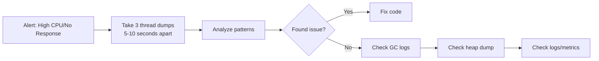

**Key Takeaways:**
- Always take **3-5 thread dumps** at intervals to see progression
- Correlate with CPU/memory metrics
- Look for **thread state patterns** not just individual threads
- **BLOCKED** chains reveal contention points
- **WAITING** on specific locks indicates pool exhaustion
- **RUNNABLE** in same method indicates infinite loop or busy-wait

---

## ⚡ **Spring Boot & Microservices**

### Q1: Explain Spring Boot Auto-configuration

```mermaid
graph TD
    A[@SpringBootApplication] --> B[EnableAutoConfiguration]
    B --> C[Spring.factories<br/>META-INF/spring.factories]
    C --> D[Auto-configuration classes]
    D --> E{@Conditional checks}
    
    E --> F[ConditionalOnClass]
    E --> G[ConditionalOnMissingBean]
    E --> H[ConditionalOnProperty]
    E --> I[ConditionalOnWebApplication]
    
    F --> J[Configure beans]
    G --> J
    H --> J
    I --> J
```

**Deep Answer:**

Spring Boot auto-configuration is built on **@Conditional** annotations that automatically configure beans based on classpath dependencies, properties, and existing beans.

**Core Components:**

**1. @SpringBootApplication = @Configuration + @EnableAutoConfiguration + @ComponentScan**

**2. Auto-configuration mechanism:**
```java
// META-INF/spring/org.springframework.boot.autoconfigure.AutoConfiguration.imports
org.springframework.boot.autoconfigure.web.servlet.WebMvcAutoConfiguration
org.springframework.boot.autoconfigure.data.redis.RedisAutoConfiguration
org.springframework.boot.autoconfigure.jdbc.DataSourceAutoConfiguration
```

**3. Key Annotations:**

| Annotation | Purpose | Example |
|------------|---------|---------|
| **@ConditionalOnClass** | Configure if class exists | If `DataSource.class` present |
| **@ConditionalOnMissingBean** | Configure if bean absent | Create default `ObjectMapper` |
| **@ConditionalOnProperty** | Based on property value | `spring.datasource.url` |
| **@ConditionalOnBean** | If specific bean exists | Configure if `DataSource` exists |
| **@ConditionalOnWebApplication** | For web contexts | Only in web apps |
| **@ConditionalOnExpression** | SpEL expression | `${feature.enabled:true}` |

**Example - How DataSource Auto-configuration Works:**

```java
@Configuration
@ConditionalOnClass(DataSource.class)
@ConditionalOnMissingBean(DataSource.class)
@EnableConfigurationProperties(DataSourceProperties.class)
public class DataSourceAutoConfiguration {
    
    @Bean
    @ConditionalOnProperty(name = "spring.datasource.url")
    public DataSource dataSource(DataSourceProperties properties) {
        // Create HikariCP/Tomcat/Commons DBCP based on classpath
        return properties.initializeDataSourceBuilder().build();
    }
}
```

**Custom Auto-configuration:**
```java
// 1. Create configuration class
@Configuration
@ConditionalOnClass(MyService.class)
public class MyServiceAutoConfiguration {
    
    @Bean
    @ConditionalOnMissingBean
    public MyService myService(MyProperties properties) {
        return new MyService(properties.getUrl());
    }
}

// 2. Add to spring.factories
org.springframework.boot.autoconfigure.EnableAutoConfiguration=\
com.example.MyServiceAutoConfiguration

// 3. Create properties
@ConfigurationProperties("my.service")
public class MyProperties {
    private String url;
    // getters/setters
}
```

**Override Auto-configuration:**
```java
// 1. Define your own bean - overrides auto-config
@Bean
public DataSource dataSource() {
    return new HikariDataSource(); // Your custom config
}

// 2. Exclude specific auto-config
@SpringBootApplication(exclude = DataSourceAutoConfiguration.class)

// 3. Use properties
spring.autoconfigure.exclude=org.springframework.boot.autoconfigure.jdbc.DataSourceAutoConfiguration
```

**Auto-configuration Report:**
```yaml
# Enable debug logging to see auto-config report
debug: true
```

```
Positive matches:
-----------------
   DataSourceAutoConfiguration matched:
      - @ConditionalOnClass found required classes 'javax.sql.DataSource'

Negative matches:
-----------------
   ActiveMQAutoConfiguration:
      Did not match:
         - @ConditionalOnClass did not find required class 'javax.jms.ConnectionFactory'
```

**Conditional Evaluation Order:**
1. **@ConditionalOnClass** - Check dependencies
2. **@ConditionalOnBean/MissingBean** - Check existing beans
3. **@ConditionalOnProperty** - Check configuration
4. **@ConditionalOnResource** - Check file existence
5. **@ConditionalOnWebApplication** - Check context type

**Performance Impact:**
- Auto-config classes loaded at startup
- Conditional evaluations cached
- Use `spring.autoconfigure.exclude` for unused starters

---

### Q2: Difference between @Component, @Service, @Repository, @Controller

```mermaid
graph TD
    subgraph "Spring Stereotypes"
        A[@Component] --> B[Generic Component]
        A --> C[@Service]
        A --> D[@Repository]
        A --> E[@Controller]
        
        C --> F[Business Logic<br/>Service layer]
        D --> G[Data Access<br/>Persistence layer]
        E --> H[Web layer<br/>MVC Controller]
    end
```

**Deep Answer:**

**1. @Component - Generic Spring-managed bean**
```java
@Component
public class UtilityHelper {
    public String formatData(String input) {
        return input.toUpperCase();
    }
}
```
- Base annotation for all Spring beans
- Scans and registers as bean
- No specific behavior added

**2. @Service - Business logic layer**
```java
@Service
public class PaymentService {
    
    @Autowired
    private PaymentRepository repository;
    
    @Transactional
    public Payment processPayment(Order order) {
        // Business logic, validation, calculations
        Payment payment = calculatePayment(order);
        return repository.save(payment);
    }
}
```
- Indicates business logic
- Transaction boundaries typically here
- Better semantic meaning
- **No extra technical behavior** over @Component (in Spring)
- Some frameworks add transaction advice

**3. @Repository - Data access layer**
```java
@Repository
public class UserRepository {
    
    @PersistenceContext
    private EntityManager entityManager;
    
    public User findById(Long id) {
        return entityManager.find(User.class, id);
    }
    
    // Spring translates JPA exceptions to DataAccessException
}
```
- **Persistence exception translation** - converts vendor-specific SQLExceptions to Spring's DataAccessException hierarchy
- Indicates DAO operations
- Works with JPA, Hibernate, JDBC

**Exception translation:**
```java
// Without @Repository, you get:
try {
    userRepository.save(user);
} catch (HibernateException e) {
    throw new RuntimeException(e); // Vendor-specific
}

// With @Repository, Spring translates:
try {
    userRepository.save(user);
} catch (DataAccessException e) {
    // Generic Spring exception
}
```

**4. @Controller - Web layer**
```java
@Controller
@RequestMapping("/api/users")
public class UserController {
    
    @GetMapping("/{id}")
    public String getUser(@PathVariable Long id, Model model) {
        model.addAttribute("user", userService.findById(id));
        return "user/profile"; // View name
    }
}
```
- Web request handling
- Returns view names (with ViewResolver)
- Can also use @ResponseBody for REST

**5. @RestController = @Controller + @ResponseBody**
```java
@RestController
@RequestMapping("/api/users")
public class UserRestController {
    
    @GetMapping("/{id}")
    public User getUser(@PathVariable Long id) {
        return userService.findById(id); // Direct JSON response
    }
}
```

**Internal Differences:**

| Aspect | @Component | @Service | @Repository | @Controller |
|--------|------------|----------|-------------|-------------|
| **Semantic** | Generic | Business | Persistence | Web |
| **Exception Translation** | No | No | Yes | No |
| **Proxy Mode** | Default | Default | Default | CGLIB (usually) |
| **AOP Pointcuts** | Can target | Business layer | DAO layer | Web layer |
| **Special Handling** | None | None | PersistenceExceptionTranslator | Model attributes |

**Why separate annotations if they're technically the same?**

```java
// AOP Pointcut example
@Pointcut("@within(org.springframework.stereotype.Repository)")
public void repositoryMethods() { }

@Pointcut("@within(org.springframework.stereotype.Service)") 
public void serviceMethods() { }

// Apply transaction advice only to services
@Around("serviceMethods() && execution(* *(..))")
public Object transactional(ProceedingJoinPoint pjp) {
    // Start transaction
}

// Apply performance logging only to controllers
@Around("controllerMethods()")
public Object logPerformance(ProceedingJoinPoint pjp) {
    // Log web request timing
}
```

**Spring's internal use:**
- **@Controller** detected for web mapping registration
- **@Repository** triggers PersistenceExceptionTranslationPostProcessor
- **@Service** used for component scanning filters

**Best Practices:**
```java
// DO - Use appropriate annotations
@Service
@Transactional
public class OrderService { }

// DON'T - Mix concerns
@Repository
@Service  // Wrong - can't have both
public class BadService { }

// DO - Layer your application
@Controller → @Service → @Repository
     ↓           ↓           ↓
  Web Layer   Business    Data Access
```

**Component Scanning:**
```java
@Configuration
@ComponentScan(
    basePackages = "com.example",
    includeFilters = @ComponentScan.Filter(
        type = FilterType.ANNOTATION,
        classes = Service.class
    ),
    excludeFilters = @ComponentScan.Filter(
        type = FilterType.REGEX,
        pattern = ".*Test.*"
    )
)
```

**Performance:**
- All annotations have same runtime cost
- Scanning overhead at startup
- Use `@Lazy` for expensive beans

---

### Q3: Microservices - Service Discovery & API Gateway

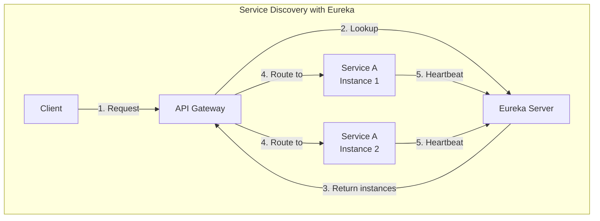

**Deep Answer:**

**Service Discovery Patterns:**

**1. Client-Side Discovery**
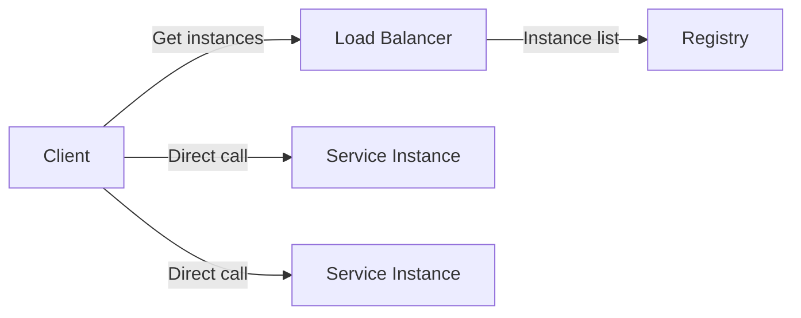

**2. Server-Side Discovery (API Gateway)**
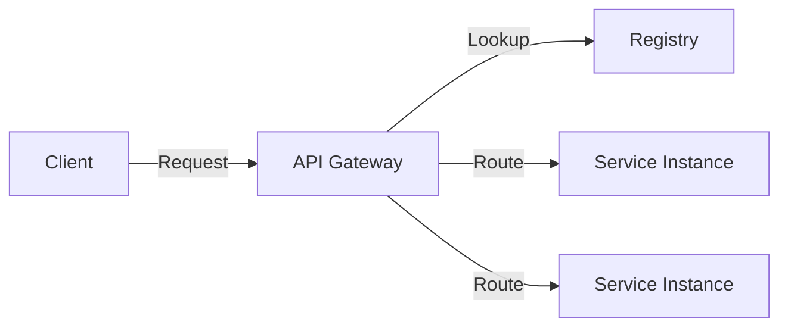

**Eureka Implementation:**

**Eureka Server:**
```java
@SpringBootApplication
@EnableEurekaServer
public class ServiceRegistryApplication {
    public static void main(String[] args) {
        SpringApplication.run(ServiceRegistryApplication.class, args);
    }
}
```

**application.yml:**
```yaml
server:
  port: 8761
  
eureka:
  instance:
    hostname: localhost
  client:
    register-with-eureka: false
    fetch-registry: false
    service-url:
      defaultZone: http://${eureka.instance.hostname}:${server.port}/eureka/
```

**Eureka Client (Service):**
```java
@SpringBootApplication
@EnableEurekaClient  // or @EnableDiscoveryClient
public class PaymentServiceApplication {
    public static void main(String[] args) {
        SpringApplication.run(PaymentServiceApplication.class, args);
    }
}
```

**application.yml:**
```yaml
spring:
  application:
    name: payment-service
    
eureka:
  client:
    service-url:
      defaultZone: http://localhost:8761/eureka/
  instance:
    hostname: ${HOSTNAME:localhost}
    prefer-ip-address: true
    lease-renewal-interval-in-seconds: 30  # Heartbeat interval
    lease-expiration-duration-in-seconds: 90  # Time to wait before removing
```

**Eureka Internals:**

| Component | Purpose | Implementation |
|-----------|---------|----------------|
| **Registry** | Stores service instances | ConcurrentHashMap |
| **Lease** | Tracks instance health | Last heartbeat timestamp |
| **Renewal** | Client heartbeat | REST endpoint /renew |
| **Eviction** | Remove dead instances | Scheduled task (60s) |
| **Replication** | Sync between Eureka servers | Peer-to-peer HTTP |

**Eureka REST API:**
```bash
# Register instance
POST /eureka/apps/PAYMENT-SERVICE

# Heartbeat
PUT /eureka/apps/PAYMENT-SERVICE/instance-id

# Get instances
GET /eureka/apps/PAYMENT-SERVICE

# Response:
{
  "application": {
    "name": "PAYMENT-SERVICE",
    "instance": [
      {
        "instanceId": "host:payment-service:8080",
        "hostName": "192.168.1.100",
        "port": 8080,
        "status": "UP",
        "metadata": { "version": "v1" }
      }
    ]
  }
}
```

**API Gateway with Spring Cloud Gateway:**

```java
@SpringBootApplication
@EnableDiscoveryClient
public class GatewayApplication {
    
    @Bean
    public RouteLocator customRouteLocator(RouteLocatorBuilder builder) {
        return builder.routes()
            .route("payment-service", r -> r
                .path("/api/payments/**")
                .filters(f -> f
                    .circuitBreaker(config -> config
                        .setName("paymentCB")
                        .setFallbackUri("forward:/fallback/payments"))
                    .retry(config -> config
                        .setRetries(3)
                        .setStatuses(HttpStatus.SERVICE_UNAVAILABLE))
                    .requestRateLimiter(config -> config
                        .setRateLimiter(redisRateLimiter())))
                .uri("lb://payment-service"))  // Load balanced
            
            .route("order-service", r -> r
                .path("/api/orders/**")
                .filters(f -> f
                    .addRequestHeader("X-Gateway-Version", "1.0")
                    .addResponseHeader("X-Response-Time", LocalDateTime.now().toString()))
                .uri("lb://order-service"))
            .build();
    }
    
    @Bean
    public RedisRateLimiter redisRateLimiter() {
        return new RedisRateLimiter(10, 20, 1); // replenishRate, burstCapacity, requestedTokens
    }
}
```

**application.yml:**
```yaml
spring:
  cloud:
    gateway:
      discovery:
        locator:
          enabled: true
          lower-case-service-id: true
      globalcors:
        cors-configurations:
          '[/**]':
            allowedOrigins: "*"
            allowedMethods: "*"
      default-filters:
        - name: GlobalCircuitBreaker
          args:
            name: globalCB
            fallbackUri: forward:/fallback
```

**API Gateway Responsibilities:**

| Responsibility | Implementation |
|----------------|----------------|
| **Routing** | Route to appropriate service |
| **Load Balancing** | Ribbon/Spring Cloud LoadBalancer |
| **Authentication** | JWT validation, OAuth2 |
| **Rate Limiting** | Redis-based token bucket |
| **Circuit Breaking** | Resilience4J |
| **Request/Response Transformation** | Modify headers/body |
| **Aggregation** | Combine multiple service responses |
| **Caching** | Redis cache for frequent requests |
| **Monitoring** | Micrometer metrics |

**Load Balancing with Ribbon (deprecated) / Spring Cloud LoadBalancer:**

```java
@Configuration
public class LoadBalancerConfig {
    
    @Bean
    public ServiceInstanceListSupplier discoveryClientServiceInstanceListSupplier(
            ConfigurableApplicationContext context) {
        return ServiceInstanceListSupplier.builder()
            .withDiscoveryClient()
            .withHealthChecks()
            .withCaching()
            .build(context);
    }
    
    @Bean
    public ReactorLoadBalancer<ServiceInstance> randomLoadBalancer(
            Environment environment,
            LoadBalancerClientFactory loadBalancerClientFactory) {
        String name = environment.getProperty(LoadBalancerClientFactory.PROPERTY_NAME);
        return new RandomLoadBalancer(
            loadBalancerClientFactory.getLazyProvider(name, ServiceInstanceListSupplier.class),
            name
        );
    }
}
```

**Custom Load Balancing Strategy:**

```java
public class ZonePreferenceLoadBalancer implements ReactorServiceInstanceLoadBalancer {
    
    private final String zone;
    private final ObjectProvider<ServiceInstanceListSupplier> supplier;
    
    @Override
    public Mono<Response<ServiceInstance>> choose(Request request) {
        return supplier.get(request).next()
            .map(instances -> {
                List<ServiceInstance> zoneInstances = instances.stream()
                    .filter(i -> zone.equals(i.getMetadata().get("zone")))
                    .collect(Collectors.toList());
                    
                if (!zoneInstances.isEmpty()) {
                    return Response.from(chooseRandom(zoneInstances));
                }
                return Response.from(chooseRandom(instances));
            });
    }
}
```

**Health Checking:**

```java
@Component
public class CustomHealthIndicator implements HealthIndicator {
    
    @Override
    public Health health() {
        // Check database, external services, etc.
        if (checkDatabase()) {
            return Health.up()
                .withDetail("database", "available")
                .build();
        }
        return Health.down()
            .withDetail("database", "unavailable")
            .build();
    }
}
```

**Eureka Health Check:**
```yaml
eureka:
  client:
    healthcheck:
      enabled: true  # Use Spring Boot health endpoint
```

**Service Discovery in Kubernetes:**

```yaml
# Kubernetes native discovery (no Eureka needed)
apiVersion: v1
kind: Service
metadata:
  name: payment-service
spec:
  selector:
    app: payment
  ports:
  - port: 8080
    targetPort: 8080
---
# Spring Boot config
spring:
  cloud:
    kubernetes:
      discovery:
        enabled: true
        all-namespaces: true
```

**Comparison of Discovery Solutions:**

| Feature | Eureka | Consul | Zookeeper | Kubernetes |
|---------|--------|--------|-----------|------------|
| **CAP** | AP | CP | CP | AP (etcd) |
| **Health Check** | Client heartbeat | Service check | Session | Readiness/liveness |
| **Multi-DC** | Yes | Yes | No | Yes |
| **KV Store** | No | Yes | Yes | Yes (ConfigMap) |
| **Security** | Basic | ACL | ACL | RBAC |
| **Language** | Java | Go | Java | Go |

**Failure Scenarios:**

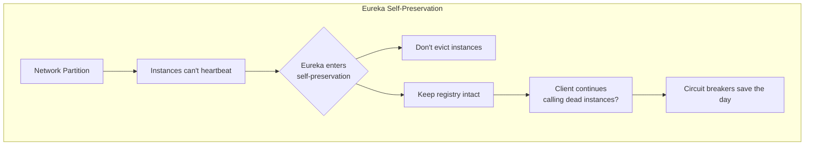

**Self-Preservation:**
```yaml
eureka:
  server:
    enable-self-preservation: true
    renewal-percent-threshold: 0.85  # If <85% renewals, trigger
    eviction-interval-timer-in-ms: 60000
```

**Client-side Resilience:**
```java
@Configuration
public class ResilienceConfig {
    
    @Bean
    public Customizer<Resilience4JCircuitBreakerFactory> circuitBreakerCustomizer() {
        return factory -> factory.configure(builder -> builder
            .circuitBreakerConfig(CircuitBreakerConfig.custom()
                .failureRateThreshold(50)
                .waitDurationInOpenState(Duration.ofMillis(1000))
                .slidingWindowSize(10)
                .build())
            .timeLimiterConfig(TimeLimiterConfig.custom()
                .timeoutDuration(Duration.ofSeconds(2))
                .build()), "paymentService");
    }
}
```

**Key Takeaways for JPMorgan:**
- Financial systems need **high availability** - use multiple discovery zones
- **Circuit breakers** essential to prevent cascade failures
- **Self-preservation** protects against network issues but requires client-side retry logic
- **Metadata** can carry version, zone, environment for smart routing
- **Security** - secure service-to-service communication with mTLS

---

## 🔄 **Messaging & Event-Driven Architecture**

### Q1: When would you use Kafka vs RabbitMQ vs ActiveMQ?

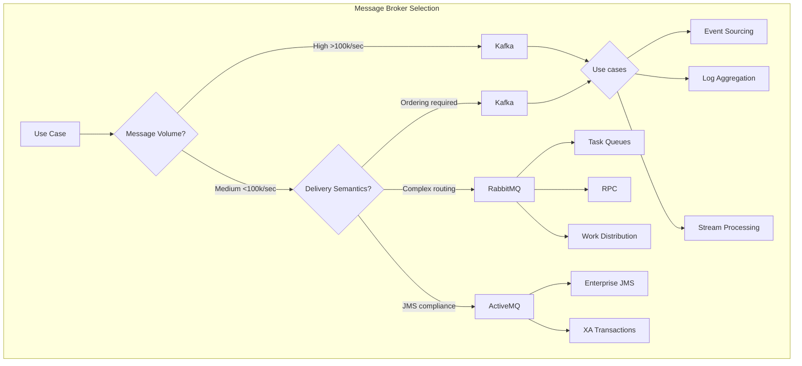

**Deep Answer:**

**Kafka - Distributed Event Streaming Platform**

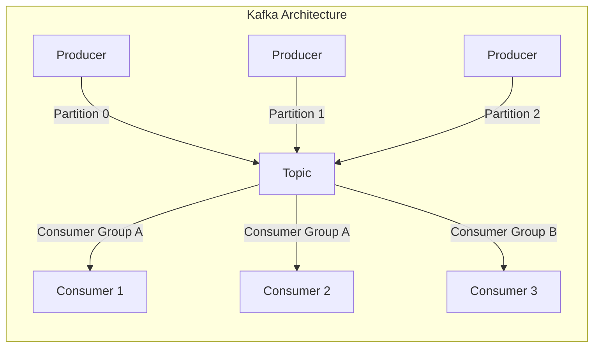

**Best for:**
- **High throughput** (millions of messages/sec)
- **Event sourcing** and **CQRS**
- **Stream processing** (Kafka Streams, ksqlDB)
- **Log aggregation** and metrics
- **Commit log** for distributed systems
- **Long-term storage** (configurable retention)

**Key Features:**
```java
// Kafka Producer
Properties props = new Properties();
props.put("bootstrap.servers", "localhost:9092");
props.put("key.serializer", "org.apache.kafka.common.serialization.StringSerializer");
props.put("value.serializer", "org.apache.kafka.common.serialization.StringSerializer");
props.put("acks", "all");  // Strongest durability
props.put("retries", 3);
props.put("enable.idempotence", true);  // Exactly-once semantics

KafkaProducer<String, String> producer = new KafkaProducer<>(props);

// Send with callback
producer.send(new ProducerRecord<>("orders", "key", "value"), 
    (metadata, exception) -> {
        if (exception == null) {
            // Success - offset: 123, partition: 2
        }
    });

// Kafka Consumer with exactly-once
Properties consumerProps = new Properties();
consumerProps.put("isolation.level", "read_committed");  // Read only committed messages
consumerProps.put("enable.auto.commit", false);  // Manual commit
```

**When to choose Kafka:**
- Event-driven microservices with replay capability
- Processing huge data streams (telemetry, logs)
- Need message retention (days/weeks)
- Multiple consumers can rewind/replay

---

**RabbitMQ - Smart Broker, Flexible Routing**

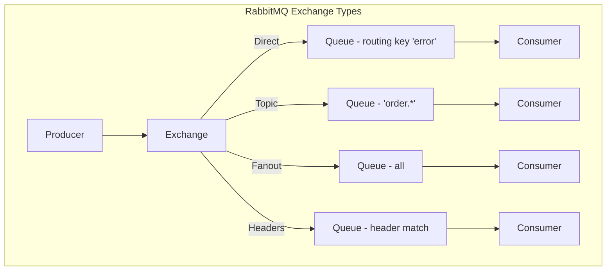

**Best for:**
- **Complex routing** (exchanges, bindings)
- **Task distribution** (work queues)
- **RPC** (Request-Reply pattern)
- **Low latency** requirements (microseconds)
- **Traditional messaging** patterns

**Key Features:**
```java
// RabbitMQ with Spring
@Configuration
public class RabbitConfig {
    
    @Bean
    public TopicExchange ordersExchange() {
        return ExchangeBuilder.topicExchange("orders")
            .durable(true)
            .build();
    }
    
    @Bean
    public Queue paymentQueue() {
        return QueueBuilder.durable("payments")
            .withArgument("x-dead-letter-exchange", "orders.dlx")
            .withArgument("x-max-length", 10000)
            .withArgument("x-message-ttL", 60000)
            .build();
    }
    
    @Bean
    public Binding binding() {
        return BindingBuilder.bind(paymentQueue())
            .to(ordersExchange())
            .with("payment.*");
    }
    
    // Request-Reply pattern
    @Bean
    public RabbitTemplate rabbitTemplate(ConnectionFactory connectionFactory) {
        RabbitTemplate template = new RabbitTemplate(connectionFactory);
        template.setReplyTimeout(5000);
        template.setUseDirectReplyToContainer(true);  // Uses temporary queues
        return template;
    }
}

// Consumer with reply
@RabbitListener(queues = "payment.queue")
@SendTo("payment.reply.queue")
public String handlePayment(String message) {
    // Process
    return "Processed: " + message;
}
```

**When to choose RabbitMQ:**
- Need sophisticated routing (topic, headers)
- Request-reply patterns with temporary queues
- Short-lived messages, low latency
- Integration with multiple systems

---

**ActiveMQ - JMS Standard, Enterprise Features**

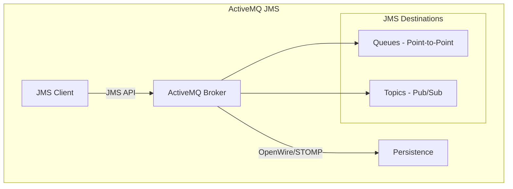

**Best for:**
- **JMS compliance** (Jakarta EE)
- **XA transactions** (distributed transactions)
- **Java-centric** environments
- **Enterprise integration** (ERP, CRM)
- **Protocol flexibility** (OpenWire, STOMP, MQTT, AMQP)

**Key Features:**
```java
// ActiveMQ JMS with Spring
@Configuration
@EnableJms
public class ActiveMQConfig {
    
    @Bean
    public JmsListenerContainerFactory<?> jmsListenerContainerFactory(
            ConnectionFactory connectionFactory) {
        DefaultJmsListenerContainerFactory factory = new DefaultJmsListenerContainerFactory();
        factory.setConnectionFactory(connectionFactory);
        factory.setConcurrency("3-10");  // Concurrent consumers
        factory.setSessionTransacted(true);  // For XA transactions
        factory.setCacheLevel(DefaultMessageListenerContainer.CACHE_CONSUMER);
        return factory;
    }
    
    @Bean
    public JmsTemplate jmsTemplate(ConnectionFactory connectionFactory) {
        JmsTemplate template = new JmsTemplate(connectionFactory);
        template.setDeliveryMode(DeliveryMode.PERSISTENT);
        template.setExplicitQosEnabled(true);
        template.setTimeToLive(60000);  // 60 seconds
        return template;
    }
}

// XA Transaction example
@Transactional
public void processOrder(Order order) {
    // Send to JMS queue
    jmsTemplate.convertAndSend("order.queue", order);
    
    // Update database
    orderRepository.save(order);
    
    // Both operations commit or rollback together
}

// Request-Reply with temporary queue
public String requestReply(String request) {
    // Spring automatically creates temp queue
    return jmsTemplate.convertSendAndReceive("request.queue", 
        request, String.class);
}
```

**When to choose ActiveMQ:**
- Legacy JMS integration
- Need XA transactions across DB + message broker
- Java EE application servers
- Protocol bridging required

---

### Comparison Table

| Feature | Kafka | RabbitMQ | ActiveMQ |
|---------|-------|----------|----------|
| **Throughput** | 1M+ msgs/sec | 50k msgs/sec | 10k msgs/sec |
| **Latency** | 10-100ms | <1ms | 1-10ms |
| **Message Model** | Pull-based | Push-based | Push-based |
| **Ordering** | Within partition | Per queue | Per queue |
| **Retention** | Configurable (days) | Until acked | Until acked |
| **Routing** | Topic only | Exchange types | JMS selectors |
| **Protocols** | Custom binary | AMQP | OpenWire, STOMP, AMQP, MQTT |
| **Transactions** | Producer/consumer txn | AMQP txns | XA, JMS txn |
| **Exactly-once** | Yes (since 0.11) | No (at-least-once) | No (at-least-once) |
| **Rebalancing** | Consumer group rebalance | HA queues | Network of brokers |
| **Use Case** | Event streaming | Microservices | Enterprise JMS |

---

### Selection Guide for JPMorgan

**Trading Systems (High Frequency):**
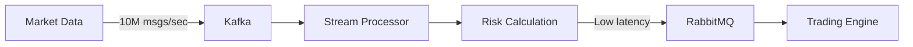

**Order Processing (Transactional):**
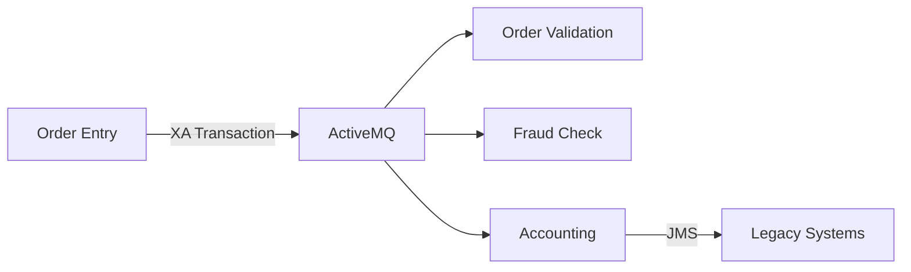

**Event-Driven Microservices:**
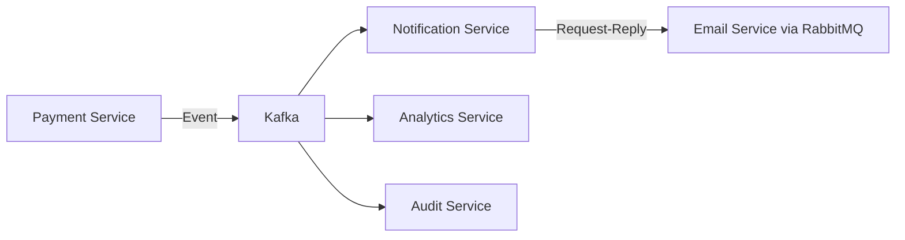

**Decision Matrix:**

| Requirement | Recommended |
|-------------|-------------|
| Need message replay | **Kafka** |
| Low latency (<5ms) | **RabbitMQ** |
| JMS/Java EE | **ActiveMQ** |
| Distributed transactions | **ActiveMQ** (XA) |
| Stream processing | **Kafka** |
| Complex routing | **RabbitMQ** |
| Long retention | **Kafka** |
| Protocol bridging | **ActiveMQ** |

---

### Q2: Explain exactly-once vs at-least-once vs at-most-once delivery

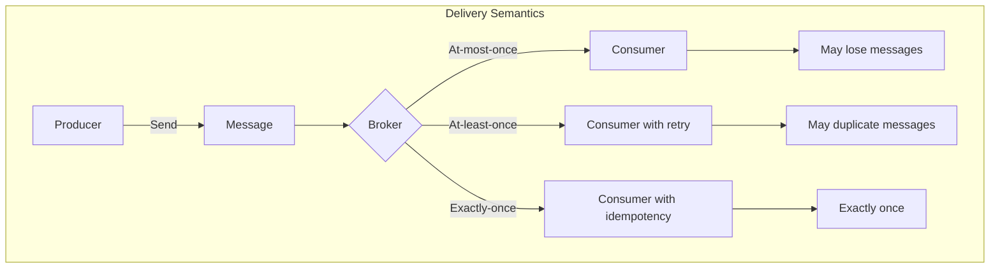

**Deep Answer:**

**1. At-Most-Once (Fire and Forget)**

```java
// Kafka - At most once
props.put("acks", "0");  // No acknowledgment
producer.send(record);   // Fire and forget - may lose

// ActiveMQ/JMS
jmsTemplate.setDeliveryMode(DeliveryMode.NON_PERSISTENT);
jmsTemplate.setTimeToLive(0);  // No retry
```

**Characteristics:**
- Messages may be lost
- No retries
- Highest throughput
- Suitable for: **Metrics, logs, heartbeats**

**Failure scenario:**
```
Producer → Broker (fails) → Message lost → Consumer never sees it
```

---

**2. At-Least-Once (Common default)**

```java
// Kafka - At least once
props.put("acks", "all");        // Wait for all replicas
props.put("retries", 10);        // Retry on failure
props.put("enable.idempotence", false);  // May duplicate

// Consumer
consumer.commitSync();  // Commit AFTER processing

// RabbitMQ
channel.basicConsume(queue, false, (consumerTag, delivery) -> {
    process(delivery);  // Process first
    channel.basicAck(delivery.getEnvelope().getDeliveryTag(), false);  // Then ack
});
```

**Characteristics:**
- Messages never lost
- Possible duplicates
- Requires idempotent consumers
- Suitable for: **Most business events**

**Duplicate scenario:**
```
Producer → Broker (acks lost) → Retry → Duplicate message
Consumer → Process → Crash → No commit → Message redelivered
```

**3. Exactly-Once (Hardest)**

```java
// Kafka - Exactly once
props.put("enable.idempotence", true);  // Producer idempotence
props.put("acks", "all");
props.put("transactional.id", "order-service-1");  // Transactional producer

producer.initTransactions();
try {
    producer.beginTransaction();
    producer.send(record1);
    producer.send(record2);
    producer.commitTransaction();
} catch (Exception e) {
    producer.abortTransaction();
}

// Consumer with isolation level
props.put("isolation.level", "read_committed");  // Don't read uncommitted
props.put("enable.auto.commit", false);
```

**Exactly-once requires:**
1. **Idempotent producer** - Duplicate sends don't create duplicate messages
2. **Transactional producer/consumer** - Read-process-write atomically
3. **Idempotent consumer** - Same message processed once even if redelivered

**How Kafka achieves exactly-once:**

```mermaid
graph TD
    subgraph "Kafka Exactly-Once"
        P[Producer] -->|Produce with<br/>transactional ID| B[Broker]
        B -->|Store in<br/>transaction log| T[__transaction_state]
        
        C[Consumer] -->|Read committed| B
        C -->|Process| R[Result]
        C -->|Commit offset| B
        
        T -->|Coordinator| CT[Transaction Coordinator]
        CT -->|Commit/Abort| B
    end
```

**Implementation patterns:**

**Pattern 1: Idempotent Consumer**
```java
@Autowired
private MessageProcessedRepository processedRepo;

public void handleMessage(String messageId, Order order) {
    // Check if already processed
    if (processedRepo.existsById(messageId)) {
        return;  // Idempotency check
    }
    
    // Process
    orderService.process(order);
    
    // Mark as processed
    processedRepo.save(new ProcessedMessage(messageId));
}
```

**Pattern 2: Database Transactions**
```java
@Transactional
public void handleMessage(String messageId, Order order) {
    // Same DB transaction for both
    orderRepository.save(order);
    processedMessageRepository.save(new ProcessedMessage(messageId));
    // Both commit or rollback together
}
```

**Pattern 3: Kafka Transactions + Idempotent Writes**
```java
@Transactional
public void processAndForward(String event) {
    // Consume from input topic
    ConsumerRecord record = consumer.poll();
    
    // Process
    Order order = process(record);
    
    // Produce to output topic (same transaction)
    producer.send(new ProducerRecord<>("orders", order));
    
    // Commit both consumer offset and producer sends atomically
    producer.sendOffsetsToTransaction(...);
}
```

---

### Comparison Table

| Aspect | At-Most-Once | At-Least-Once | Exactly-Once |
|--------|--------------|---------------|--------------|
| **Durability** | Messages can be lost | Messages never lost | Messages never lost |
| **Duplicates** | No duplicates | Possible duplicates | No duplicates |
| **Throughput** | Highest | Medium | Lowest |
| **Complexity** | Simple | Medium | Complex |
| **Idempotency needed** | No | Yes | Yes |
| **Transactions** | No | No | Yes |

**JPMorgan Context - Financial Transactions:**

For financial systems, **exactly-once** is critical:

```java
// Money transfer - MUST be exactly once
@Transactional
public void transferMoney(String transactionId, Account from, Account to, BigDecimal amount) {
    // Idempotency check
    if (transactionLog.existsById(transactionId)) {
        throw new DuplicateTransactionException();
    }
    
    // Debit from account
    accountRepository.debit(from, amount);
    
    // Credit to account
    accountRepository.credit(to, amount);
    
    // Log transaction
    transactionLog.save(new Transaction(transactionId, from, to, amount));
    
    // Send confirmation (idempotent)
    jmsTemplate.convertAndSend("confirmation.queue", 
        new Confirmation(transactionId, "SUCCESS"));
}
```

**Trade-offs in practice:**

| Requirement | Choice |
|-------------|--------|
| Stock trades | Exactly-once |
| Order placements | Exactly-once |
| Notifications | At-least-once |
| Analytics events | At-most-once |
| Heartbeats | At-most-once |
| Audit logs | Exactly-once |

---

## 🗄️ **Databases & Data Modeling**

### Q1: Write a query to find Nth highest salary (different approaches)

**Deep Answer:**

**Sample Table:**
```sql
CREATE TABLE employees (
    id INT PRIMARY KEY,
    name VARCHAR(100),
    salary DECIMAL(10,2),
    department_id INT
);

INSERT INTO employees VALUES
(1, 'Alice', 100000, 1),
(2, 'Bob', 90000, 1),
(3, 'Charlie', 90000, 2),
(4, 'David', 85000, 1),
(5, 'Eve', 85000, 2),
(6, 'Frank', 80000, 2);
```

**Approach 1: Using LIMIT and OFFSET (MySQL, PostgreSQL)**
```sql
-- 3rd highest salary
SELECT DISTINCT salary 
FROM employees 
ORDER BY salary DESC 
LIMIT 1 OFFSET 2;  -- OFFSET = N-1

-- For N=3, returns 85000
```

**Approach 2: Using ROW_NUMBER() Window Function**
```sql
WITH ranked_salaries AS (
    SELECT 
        salary,
        ROW_NUMBER() OVER (ORDER BY salary DESC) as rank
    FROM employees
    GROUP BY salary  -- For distinct salaries
)
SELECT salary 
FROM ranked_salaries 
WHERE rank = 3;  -- 3rd highest
```

**Approach 3: Using DENSE_RANK() (handles ties)**
```sql
WITH ranked_salaries AS (
    SELECT 
        salary,
        DENSE_RANK() OVER (ORDER BY salary DESC) as rank
    FROM employees
)
SELECT DISTINCT salary 
FROM ranked_salaries 
WHERE rank = 3;  
-- DENSE_RANK: 100000(1), 90000(2), 85000(3) - no gaps
```

**Approach 4: Using Correlated Subquery**
```sql
SELECT DISTINCT salary
FROM employees e1
WHERE 3 = (
    SELECT COUNT(DISTINCT salary)
    FROM employees e2
    WHERE e2.salary >= e1.salary
);
```

**Approach 5: Using self-join**
```sql
SELECT DISTINCT e1.salary
FROM employees e1
WHERE 3 = (
    SELECT COUNT(DISTINCT e2.salary)
    FROM employees e2
    WHERE e2.salary >= e1.salary
);
```

**Approach 6: For Nth highest with duplicates included**
```sql
-- If you want 3rd highest including duplicates (90000, 90000, 85000)
WITH ordered AS (
    SELECT 
        salary,
        ROW_NUMBER() OVER (ORDER BY salary DESC) as row_num
    FROM employees  -- No GROUP BY
)
SELECT salary 
FROM ordered 
WHERE row_num = 3;  -- Returns 85000

-- If you want 3rd distinct highest
WITH ordered AS (
    SELECT 
        salary,
        ROW_NUMBER() OVER (ORDER BY salary DESC) as row_num
    FROM (SELECT DISTINCT salary FROM employees) distinct_salaries
)
SELECT salary 
FROM ordered 
WHERE row_num = 3;
```

**Performance Comparison:**

| Approach | Pros | Cons | Best For |
|----------|------|------|----------|
| **LIMIT/OFFSET** | Simple, fast for small N | Scans large result | MySQL, small tables |
| **ROW_NUMBER()** | Standard, handles ties | Window sort overhead | PostgreSQL, Oracle |
| **DENSE_RANK()** | No gaps in ranking | Slightly more compute | When rank matters |
| **Correlated subquery** | Works everywhere | Slow on large tables | Legacy databases |
| **Self-join** | No window functions | Cartesian product risk | MySQL <8.0 |

**For JPMorgan context - handling large datasets:**
```sql
-- Optimized for large tables with index on salary
CREATE INDEX idx_salary ON employees(salary DESC);

-- Use this approach for better performance
WITH ranked AS (
    SELECT salary, 
           ROW_NUMBER() OVER (ORDER BY salary DESC) as rn
    FROM (SELECT DISTINCT salary FROM employees) t
)
SELECT salary FROM ranked WHERE rn = 1000;  -- 1000th highest
```

---

### Q2: Explain ACID properties in detail

```mermaid
graph TD
    subgraph "ACID Properties"
        A[Atomicity] -->|All or nothing| T[Transaction]
        B[Consistency] -->|Valid state only| T
        C[Isolation] -->|Concurrent execution| T
        D[Durability] -->|Persist after commit| T
        
        T -->|Example: Transfer $100| O[Account A: -$100]
        T -->|Example: Transfer $100| O2[Account B: +$100]
    end
```

**Deep Answer:**

**1. Atomicity - "All or Nothing"**

```java
@Transactional
public void transferMoney(Long fromId, Long toId, BigDecimal amount) {
    // These operations are atomic
    accountRepository.withdraw(fromId, amount);
    accountRepository.deposit(toId, amount);
    // If any fails, both roll back
}
```

**How databases implement:**
- **Write-Ahead Logging (WAL)** - Log changes before applying
- **Undo logs** - Rollback information
- **Transaction log** - Commit/abort markers

```sql
-- Under the hood
BEGIN;
    UPDATE accounts SET balance = balance - 100 WHERE id = 1;
    -- WAL: "id=1 balance old=500 new=400"
    
    UPDATE accounts SET balance = balance + 100 WHERE id = 2;
    -- WAL: "id=2 balance old=200 new=300"
    
    -- If crash here, both undone on recovery
COMMIT;
-- WAL: "Transaction committed"
```

**2. Consistency - "Valid State Only"**

```java
@Entity
public class Account {
    @Column(nullable = false)
    private BigDecimal balance;
    
    @PreUpdate
    public void validate() {
        if (balance.compareTo(BigDecimal.ZERO) < 0) {
            throw new InvalidStateException("Balance cannot be negative");
        }
    }
}
```

**Database constraints ensure consistency:**
```sql
CREATE TABLE accounts (
    id INT PRIMARY KEY,
    balance DECIMAL(10,2) CHECK (balance >= 0),
    account_type VARCHAR(20) CHECK (account_type IN ('SAVINGS', 'CHECKING')),
    customer_id INT REFERENCES customers(id)  -- Foreign key
);
```

**3. Isolation - "Concurrent Transactions"**

```mermaid
graph TD
    subgraph "Isolation Levels"
        T1[Transaction 1] -->|Read| D[(Database)]
        T2[Transaction 2] -->|Write| D
        
        subgraph "Problems Prevented"
            P1[Dirty Read - Read uncommitted data]
            P2[Non-repeatable Read - Data changes between reads]
            P3[Phantom Read - New rows appear]
        end
    end
```

**Isolation Levels and Phenomena:**

| Isolation Level | Dirty Read | Non-repeatable Read | Phantom Read | Implementation |
|-----------------|------------|---------------------|---------------|----------------|
| **READ UNCOMMITTED** | ❌ Allowed | ❌ Allowed | ❌ Allowed | No locking |
| **READ COMMITTED** | ✅ Prevented | ❌ Allowed | ❌ Allowed | Read locks released after read |
| **REPEATABLE READ** | ✅ Prevented | ✅ Prevented | ❌ Allowed | Read locks held until commit |
| **SERIALIZABLE** | ✅ Prevented | ✅ Prevented | ✅ Prevented | Range locks/ predicate locking |

**Example of isolation problems:**

```sql
-- Transaction 1
BEGIN;
SELECT balance FROM accounts WHERE id = 1; -- Returns 500

-- Transaction 2 (concurrent)
UPDATE accounts SET balance = 400 WHERE id = 1;
COMMIT;

-- Transaction 1 (continued)
SELECT balance FROM accounts WHERE id = 1; 
-- READ COMMITTED: 400 (non-repeatable read)
-- REPEATABLE READ: 500 (original value preserved)
COMMIT;
```

**4. Durability - "Persisted Forever"**

```java
@Transactional
public Order createOrder(Order order) {
    orderRepository.save(order);
    // After commit, this order survives any crash
    return order;
}
```

**Implementation:**
- **WAL (Write-Ahead Log)** - Log written to disk before commit returns
- **Checkpoints** - Periodic flushing of dirty pages
- **Replication** - Copies to multiple nodes

```sql
-- PostgreSQL durability settings
synchronous_commit = on      -- Wait for WAL flush
fsync = on                   -- Force OS to flush to disk
full_page_writes = on        -- Prevent partial page writes
```

**ACID in Distributed Systems:**

```mermaid
graph LR
    subgraph "Distributed Transaction"
        A[Application] -->|Begin| B[Transaction Coordinator]
        B -->|Prepare| C[Service 1]
        B -->|Prepare| D[Service 2]
        B -->|Prepare| E[Service 3]
        
        C -->|Ready| B
        D -->|Ready| B
        E -->|Ready| B
        
        B -->|Commit| C
        B -->|Commit| D
        B -->|Commit| E
    end
```

**2-Phase Commit (2PC):**
1. **Prepare Phase** - All participants must agree
2. **Commit Phase** - All commit if all prepared

**Trade-offs in financial systems:**

| Requirement | ACID Implementation |
|-------------|---------------------|
| Account balance | SERIALIZABLE |
| Order history | REPEATABLE READ |
| Read-only reports | READ COMMITTED |
| Real-time analytics | READ UNCOMMITTED |

**JPMorgan-specific considerations:**

```java
// Trading system - need strong consistency
@Transactional(isolation = Isolation.SERIALIZABLE)
public Trade executeTrade(TradeOrder order) {
    // Check sufficient funds
    Account account = accountRepository.findById(order.getAccountId());
    
    if (account.getBalance().compareTo(order.getAmount()) < 0) {
        throw new InsufficientFundsException();
    }
    
    // Execute trade
    Trade trade = tradeRepository.save(order.toTrade());
    
    // Update balance
    account.setBalance(account.getBalance().subtract(order.getAmount()));
    accountRepository.save(account);
    
    return trade;
}
```

---

## 🏗️ **System Design & Architecture**

### Q1: Design a payment processing system

```mermaid
graph TD
    subgraph "Payment Processing System"
        Client -->|1. Payment Request| API[API Gateway]
        
        API -->|2. Route| PS[Payment Service]
        
        subgraph "Payment Service"
            PS -->|Validate| V[Validator]
            PS -->|Process| PE[Payment Engine]
            PS -->|Persist| DB[(Payment DB)]
        end
        
        PE -->|3. Call| PSP[Payment Service Provider]
        PSP -->|4. Response| PE
        
        PE -->|5. Event| K[Kafka]
        K -->|Notification| N[Notification Service]
        K -->|Ledger| L[Ledger Service]
        K -->|Analytics| A[Analytics Service]
        
        PS -->|6. Response| Client
    end
```

**Deep Answer:**

**1. API Layer**
```java
@RestController
@RequestMapping("/api/v1/payments")
public class PaymentController {
    
    @PostMapping
    public ResponseEntity<PaymentResponse> processPayment(
            @Valid @RequestBody PaymentRequest request,
            @RequestHeader("Idempotency-Key") String idempotencyKey) {
        
        PaymentResponse response = paymentService.process(request, idempotencyKey);
        return ResponseEntity.accepted().body(response);
    }
}
```

**2. Idempotency Handling (Critical for payments)**
```java
@Service
public class PaymentService {
    
    @Autowired
    private IdempotencyRepository idempotencyRepo;
    
    @Transactional
    public PaymentResponse process(PaymentRequest request, String idempotencyKey) {
        // Check if already processed
        Optional<IdempotencyRecord> existing = 
            idempotencyRepo.findById(idempotencyKey);
        
        if (existing.isPresent()) {
            // Return cached response (idempotent)
            return existing.get().getResponse();
        }
        
        // Process payment
        PaymentResponse response = executePayment(request);
        
        // Store idempotency record
        idempotencyRepo.save(new IdempotencyRecord(
            idempotencyKey, 
            request, 
            response,
            Instant.now().plus(Duration.ofDays(1)) // TTL
        ));
        
        return response;
    }
}
```

**3. Payment State Machine**
```mermaid
graph LR
    A[INITIATED] -->|Validate| B[VALIDATED]
    B -->|Authorize| C[AUTHORIZED]
    C -->|Capture| D[CAPTURED]
    D -->|Settle| E[SETTLED]
    
    C -->|Void| F[VOIDED]
    B -->|Decline| G[DECLINED]
    D -->|Refund| H[REFUNDED]
```

```java
public enum PaymentState {
    INITIATED,
    VALIDATED,
    AUTHORIZED,
    CAPTURED,
    SETTLED,
    DECLINED,
    VOIDED,
    REFUNDED,
    FAILED
}

@Component
@StateMachine(name = "paymentStateMachine")
public class PaymentStateMachine {
    
    @Autowired
    private PaymentRepository paymentRepo;
    
    @WithStateMachine
    public Payment processPayment(Payment payment) {
        // State transitions handled automatically
        return payment;
    }
    
    @OnTransition(target = "CAPTURED")
    public void onCapture(Payment payment) {
        // Send to settlement batch
        settlementService.addToBatch(payment);
    }
}
```

**4. Integration with Payment Providers**
```java
@Service
public class PaymentGatewayRouter {
    
    @Autowired
    private List<PaymentGateway> gateways;
    
    public PaymentResult process(Payment payment) {
        // Route based on amount, currency, region
        PaymentGateway gateway = selectGateway(payment);
        
        // Circuit breaker pattern
        return circuitBreaker.run(
            () -> gateway.process(payment),
            throwable -> fallback(payment)
        );
    }
    
    private PaymentGateway selectGateway(Payment payment) {
        if (payment.getAmount().compareTo(new BigDecimal("10000")) > 0) {
            return gateways.stream()
                .filter(g -> g.getName().equals("HIGH_VALUE_GATEWAY"))
                .findFirst()
                .orElseThrow();
        }
        
        // Round-robin for others
        return loadBalancer.choose(gateways);
    }
}
```

**5. Database Schema**
```sql
-- Payments table
CREATE TABLE payments (
    id UUID PRIMARY KEY,
    idempotency_key VARCHAR(255) UNIQUE NOT NULL,
    amount DECIMAL(19,2) NOT NULL,
    currency VARCHAR(3) NOT NULL,
    status VARCHAR(50) NOT NULL,
    payment_method VARCHAR(50) NOT NULL,
    source_account_id UUID,
    destination_account_id UUID,
    description TEXT,
    created_at TIMESTAMP NOT NULL,
    updated_at TIMESTAMP NOT NULL,
    completed_at TIMESTAMP,
    INDEX idx_status (status),
    INDEX idx_created_at (created_at)
);

-- Payment events (audit log)
CREATE TABLE payment_events (
    id UUID PRIMARY KEY,
    payment_id UUID NOT NULL,
    event_type VARCHAR(50) NOT NULL,
    previous_status VARCHAR(50),
    new_status VARCHAR(50),
    metadata JSONB,
    created_at TIMESTAMP NOT NULL,
    FOREIGN KEY (payment_id) REFERENCES payments(id),
    INDEX idx_payment_id (payment_id)
);

-- Idempotency records
CREATE TABLE idempotency_records (
    idempotency_key VARCHAR(255) PRIMARY KEY,
    request_hash VARCHAR(64) NOT NULL,
    response JSONB NOT NULL,
    expires_at TIMESTAMP NOT NULL,
    INDEX idx_expires_at (expires_at)
);

-- Settlement batches
CREATE TABLE settlement_batches (
    id UUID PRIMARY KEY,
    batch_date DATE NOT NULL,
    total_amount DECIMAL(19,2) NOT NULL,
    payment_count INT NOT NULL,
    status VARCHAR(50) NOT NULL,
    processed_at TIMESTAMP,
    INDEX idx_batch_date (batch_date)
);
```

**6. Event-Driven Architecture**
```java
@Service
public class PaymentEventPublisher {
    
    @Autowired
    private KafkaTemplate<String, PaymentEvent> kafkaTemplate;
    
    public void publishPaymentEvent(Payment payment, PaymentEventType type) {
        PaymentEvent event = PaymentEvent.builder()
            .paymentId(payment.getId())
            .type(type)
            .amount(payment.getAmount())
            .currency(payment.getCurrency())
            .timestamp(Instant.now())
            .build();
        
        kafkaTemplate.send("payment-events", payment.getId().toString(), event);
    }
}

@Component
public class LedgerConsumer {
    
    @KafkaListener(topics = "payment-events", groupId = "ledger-group")
    public void handlePaymentEvent(PaymentEvent event) {
        switch (event.getType()) {
            case CAPTURED:
                ledgerService.creditAccount(event);
                break;
            case REFUNDED:
                ledgerService.debitAccount(event);
                break;
        }
    }
}
```

**7. Reconciliation System**
```java
@Component
public class ReconciliationService {
    
    @Scheduled(cron = "0 0 2 * * *") // Daily at 2 AM
    public void reconcile() {
        // Get payments from yesterday
        List<Payment> payments = paymentRepo.findByDate(LocalDate.now().minusDays(1));
        
        // Get settlement reports from PSP
        List<SettlementReport> reports = pspClient.getSettlementReports();
        
        // Compare
        List<Discrepancy> discrepancies = compare(payments, reports);
        
        if (!discrepancies.isEmpty()) {
            alertService.sendAlert("Reconciliation discrepancies found", discrepancies);
            reconciliationRepo.saveAll(discrepancies);
        }
    }
}
```

**8. Security Measures**
```java
@Configuration
@EnableWebSecurity
public class SecurityConfig {
    
    @Bean
    public SecurityFilterChain filterChain(HttpSecurity http) {
        return http
            .authorizeRequests()
                .antMatchers("/api/v1/payments/**").hasRole("USER")
                .antMatchers("/api/v1/admin/**").hasRole("ADMIN")
                .and()
            .oauth2ResourceServer()
                .jwt()
                .and()
            .build();
    }
}

// PCI DSS Compliance
@Column(columnDefinition = "bytea")
private byte[] encryptedCardNumber;

@PreUpdate
@PrePersist
public void encryptSensitiveData() {
    if (cardNumber != null) {
        this.encryptedCardNumber = encryptionService.encrypt(cardNumber);
        this.cardNumber = null; // Don't store plaintext
    }
}
```

**9. Monitoring and Alerting**
```java
@Component
public class PaymentMetrics {
    
    private final MeterRegistry meterRegistry;
    private final Timer paymentProcessingTimer;
    
    public PaymentMetrics(MeterRegistry meterRegistry) {
        this.meterRegistry = meterRegistry;
        this.paymentProcessingTimer = Timer.builder("payment.processing.time")
            .description("Time to process payment")
            .register(meterRegistry);
    }
    
    public void recordPayment(Payment payment) {
        // Record metrics
        meterRegistry.counter("payments.total",
            "status", payment.getStatus(),
            "currency", payment.getCurrency()
        ).increment();
        
        // Track amount
        meterRegistry.summary("payments.amount").record(payment.getAmount());
        
        // Record success rate
        if ("FAILED".equals(payment.getStatus())) {
            meterRegistry.counter("payments.failed").increment();
        }
    }
}
```

**10. Disaster Recovery**
```yaml
# Multi-region deployment
spring:
  datasource:
    url: jdbc:postgresql://${DB_HOST}:5432/payments
  kafka:
    bootstrap-servers: ${KAFKA_BROKERS}
    
---
spring:
  profiles: region1
  datasource:
    url: jdbc:postgresql://region1-db:5432/payments
  kafka:
    bootstrap-servers: region1-kafka:9092
    
---
spring:
  profiles: region2
  datasource:
    url: jdbc:postgresql://region2-db:5432/payments
  kafka:
    bootstrap-servers: region2-kafka:9092
```

**Key Non-Functional Requirements:**

| Requirement | Implementation |
|-------------|----------------|
| **Availability** | 99.99% (52 minutes downtime/year) - Multi-region, active-active |
| **Durability** | No data loss - Sync replication, WAL |
| **Consistency** | Strong consistency for balances - SERIALIZABLE isolation |
| **Latency** | <100ms p99 - Caching, async processing |
| **Security** | PCI DSS Level 1 - Encryption, tokenization |
| **Audit** | Complete audit trail - Event sourcing |

---

