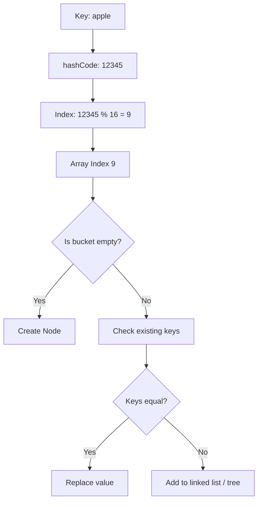
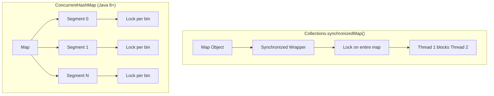
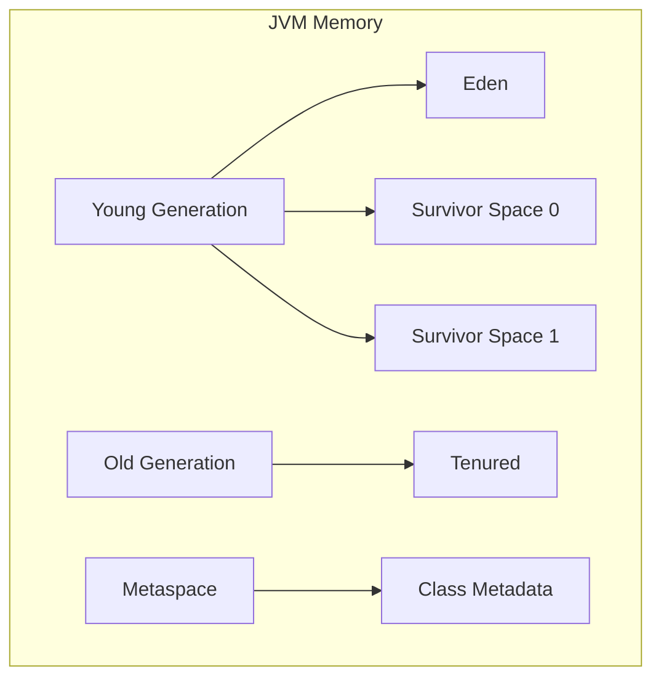
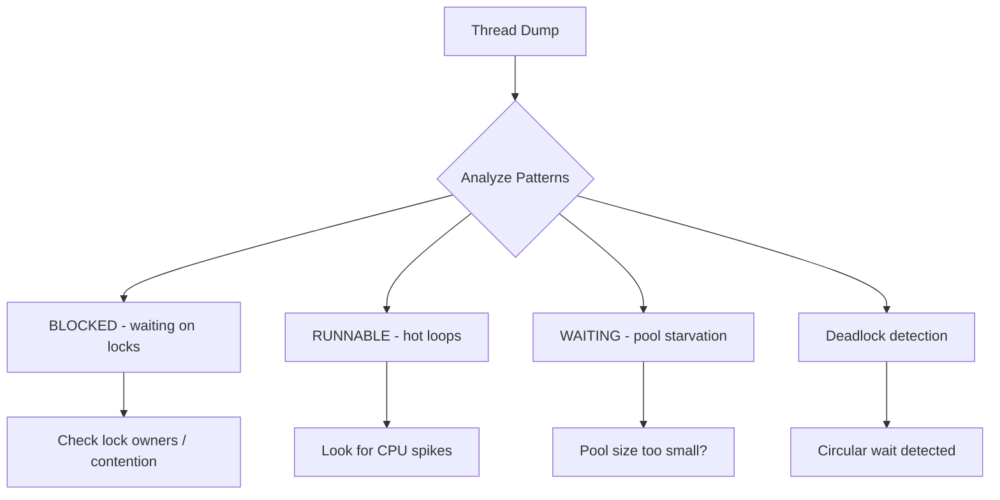
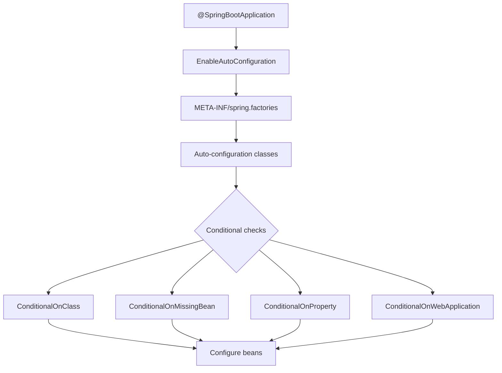
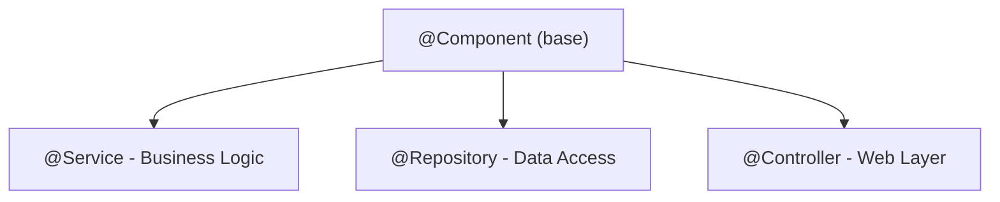
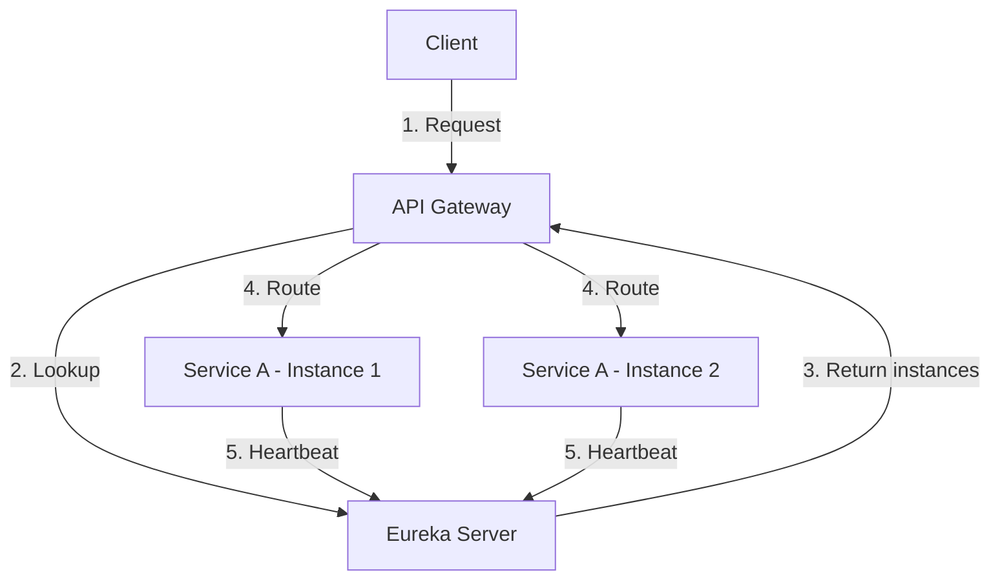
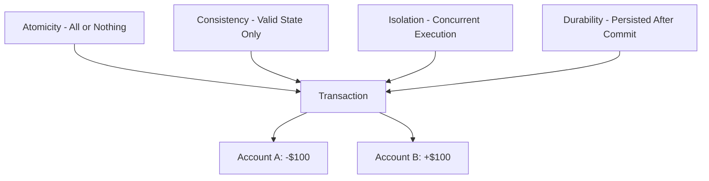
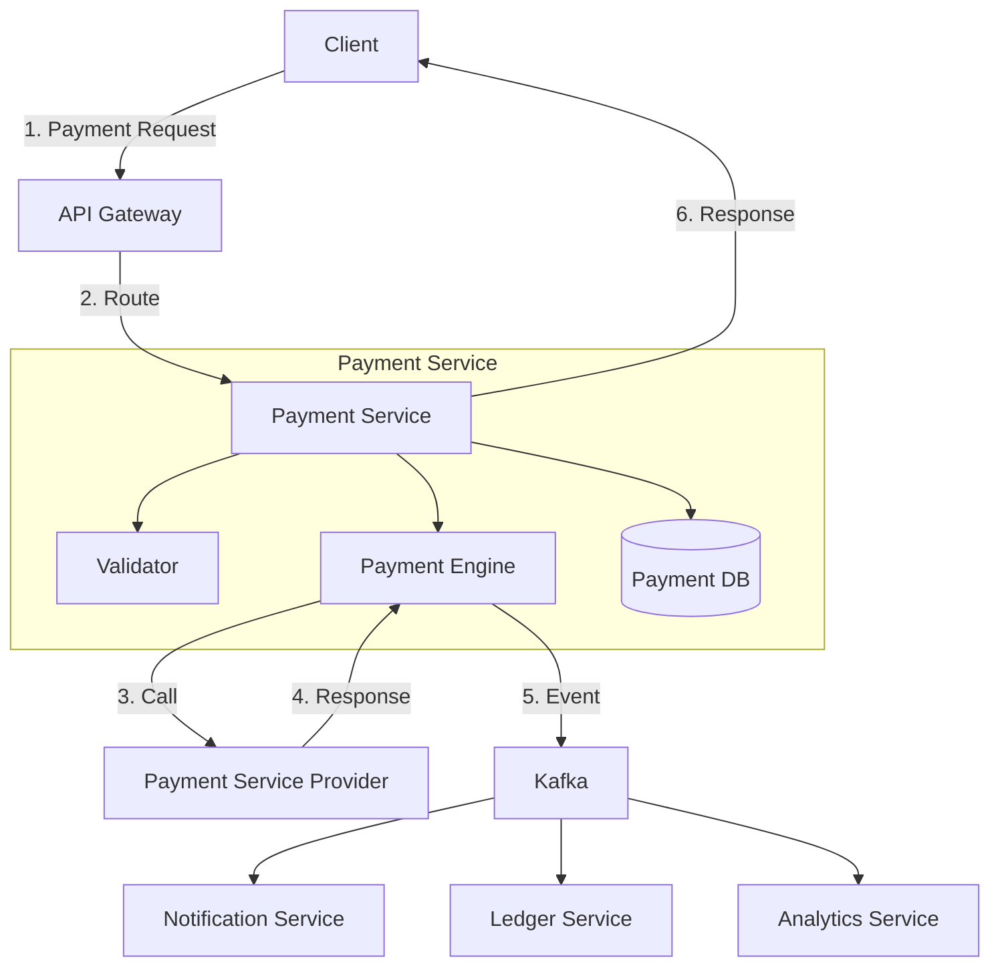
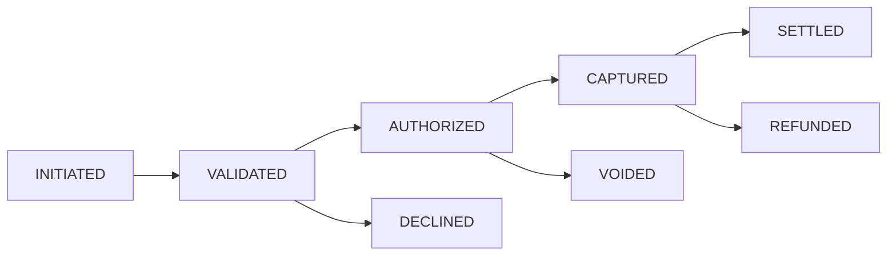

# 🏦 Deep Technical Answers for Backend Engineer - JPMorgan

---

## 🎯 Core Java & JVM

### Q1: How does HashMap work internally? What's the time complexity?



HashMap works on the principle of **hashing** with an underlying array of `Node<K,V>` called **buckets**.

**Internal Structure:**
- Default initial capacity: **16** buckets
- Default load factor: **0.75**
- Threshold = capacity × load factor (16 × 0.75 = 12)

**Put Operation:**
1. `hashCode()` is called on the key
2. Hash is perturbed: `h = key.hashCode() ^ (h >>> 16)` to distribute bits
3. Index = `(n - 1) & hash` (where n is array length)
4. At calculated index:
   - If empty → create node
   - If collision → traverse linked list (or tree)
   - If key exists → replace value
   - If new key → add to chain

**Java 8+ Optimization:**
- When collision count > 8 **AND** total buckets > 64, linked list converts to **Red-Black Tree** (O(n) → O(log n))
- When tree size < 6, converts back to linked list

**Time Complexity:**

| Case | Complexity |
|------|-----------|
| Best case (no collisions) | O(1) |
| Worst case (all keys same bucket, before treeify) | O(n) |
| After treeify | O(log n) |

**Thread Safety:** Not thread-safe. Concurrent modification can cause infinite loops (pre-Java 8), data corruption, or `ConcurrentModificationException`.

**Memory:** Each node stores hash, key, value, and next pointer (~32–48 bytes per entry).

---

### Q2: ConcurrentHashMap vs Collections.synchronizedMap()



| Feature | Collections.synchronizedMap() | ConcurrentHashMap |
|---------|------------------------------|-------------------|
| **Locking** | Entire map locked | Bucket-level (CAS + synchronized) |
| **Concurrent Reads** | Blocks (shared lock) | Fully concurrent, no blocking |
| **Concurrent Writes** | One at a time | Different buckets simultaneously |
| **Iterator** | Fail-fast (throws ConcurrentModificationException) | Weakly consistent (doesn't throw) |
| **Null keys/values** | Allowed | Not allowed |
| **Performance** | Degrades with contention | Scales linearly with cores |

**ConcurrentHashMap Internals (Java 8+):**
- `transient volatile Node<K,V>[] table` — volatile array for visibility
- **CAS (Compare-And-Swap)** for lock-free operations on empty bins
- **`synchronized`** only on specific bins during write collisions
- **`size()`** uses `baseCount` + `CounterCell` array to avoid contention
- **Multi-threaded resize** — `ForwardingNode` marks migrated buckets; concurrent reads continue during resize

---

### Q3: Garbage Collection — Algorithms and Selection



**Memory Generations:**
1. **Young Generation** (Eden + Survivor S0/S1) — new objects; Minor GC when Eden fills
2. **Old Generation** (Tenured) — long-lived objects; Major GC
3. **Metaspace** (Java 8+, replaces PermGen) — class metadata in native memory

**GC Algorithms:**

| GC | Description | Flag | Use Case |
|----|------------|------|----------|
| **Serial** | Single-thread, stop-the-world | `-XX:+UseSerialGC` | Small heaps, single-threaded apps |
| **Parallel** | Multi-thread, throughput-focused | `-XX:+UseParallelGC` | Batch processing |
| **CMS** | Concurrent sweep, low pause *(deprecated Java 14)* | `-XX:+UseConcMarkSweepGC` | Low-latency (legacy) |
| **G1** | Region-based, predictable pauses *(default Java 9+)* | `-XX:+UseG1GC` | Most production workloads |
| **ZGC** | Colored pointers, sub-millisecond pauses | `-XX:+UseZGC` | Ultra-low latency, huge heaps |

**G1 How It Works:**
- Heap divided into **regions** (1–32 MB each)
- Concurrent global marking identifies live objects
- **Mixed collections** collect young + old regions
- Remembered Sets track cross-region references

**GC Selection Guide:**

| Requirement | GC Choice |
|-------------|-----------|
| Throughput | Parallel |
| Low latency (<100ms) | G1 |
| Ultra-low latency (<10ms) | ZGC / Shenandoah |
| Small heap (<4 GB) | Serial / Parallel |
| Large heap (>100 GB) | G1 / ZGC |

**Useful Flags:**
```bash
-XX:+UseG1GC
-XX:MaxGCPauseMillis=200
-XX:G1HeapRegionSize=16m
-Xms4g -Xmx4g
-XX:+PrintGCDetails -Xloggc:gc.log
```

---

### Q4: Thread Dump Analysis for Production Debugging



**Capturing Thread Dumps:**
```bash
# jstack
jstack -l <pid> > threaddump.txt

# jcmd
jcmd <pid> Thread.print

# Unix signal
kill -3 <pid>

# Kubernetes
kubectl exec <pod> -- jstack 1 > threaddump.txt
```

**Programmatic capture:**
```java
ThreadMXBean bean = ManagementFactory.getThreadMXBean();
ThreadInfo[] infos = bean.dumpAllThreads(true, true);
for (ThreadInfo info : infos) System.out.println(info);
```

**Thread States:**

| State | Meaning | Problem Indicator |
|-------|---------|-------------------|
| **RUNNABLE** | Executing | Same method repeatedly → infinite loop |
| **BLOCKED** | Waiting for monitor | Contention / deadlocks |
| **WAITING** | park() / wait() | Pool starvation |
| **TIMED_WAITING** | sleep() / wait(timeout) | Normal for thread pools |
| **TERMINATED** | Finished | Check if premature |

**CPU Spike Investigation:**
```bash
# Find CPU-heavy thread
top -H -p <pid>

# Convert TID to hex
printf "%x\n" <thread_id>

# Find in dump
grep -A 20 "nid=0x<hex_id>" threaddump.txt
```

**Automated Deadlock Detection:**
```java
ScheduledExecutorService scheduler = Executors.newScheduledThreadPool(1);
scheduler.scheduleAtFixedRate(() -> {
    long[] deadlocked = ManagementFactory.getThreadMXBean().findDeadlockedThreads();
    if (deadlocked != null) alert("Deadlock detected!");
}, 0, 1, TimeUnit.MINUTES);
```

**Key Takeaways:**
- Always take **3–5 thread dumps** at intervals to see progression
- Correlate with CPU/memory metrics
- **BLOCKED** chains → contention points
- **WAITING** on locks → pool exhaustion
- **RUNNABLE** in same method → infinite loop or busy-wait

---

## ⚡ Spring Boot & Microservices

### Q1: Spring Boot Auto-configuration



`@SpringBootApplication` = `@Configuration` + `@EnableAutoConfiguration` + `@ComponentScan`

**Key Conditional Annotations:**

| Annotation | Purpose |
|------------|---------|
| `@ConditionalOnClass` | Configure if class is on classpath |
| `@ConditionalOnMissingBean` | Configure if bean not already defined |
| `@ConditionalOnProperty` | Based on property value |
| `@ConditionalOnBean` | If specific bean exists |
| `@ConditionalOnWebApplication` | Only in web context |

**How DataSource Auto-configuration Works:**
```java
@Configuration
@ConditionalOnClass(DataSource.class)
@ConditionalOnMissingBean(DataSource.class)
@EnableConfigurationProperties(DataSourceProperties.class)
public class DataSourceAutoConfiguration {

    @Bean
    @ConditionalOnProperty(name = "spring.datasource.url")
    public DataSource dataSource(DataSourceProperties properties) {
        return properties.initializeDataSourceBuilder().build();
    }
}
```

**Override Auto-configuration:**
```java
// Define your own bean — overrides auto-config
@Bean
public DataSource dataSource() { return new HikariDataSource(); }

// Exclude entirely
@SpringBootApplication(exclude = DataSourceAutoConfiguration.class)
```

**Debug auto-config report:**
```yaml
debug: true
```

---

### Q2: @Component vs @Service vs @Repository vs @Controller



| Annotation | Layer | Special Behavior |
|------------|-------|-----------------|
| `@Component` | Generic | None |
| `@Service` | Business | Semantic clarity; transaction boundaries |
| `@Repository` | Persistence | **Exception translation** (vendor exceptions → `DataAccessException`) |
| `@Controller` | Web | View resolution |
| `@RestController` | Web | = `@Controller` + `@ResponseBody` |

**Why separate annotations?** They enable layer-specific AOP pointcuts:
```java
@Pointcut("@within(org.springframework.stereotype.Service)")
public void serviceMethods() {}

@Around("serviceMethods()")
public Object transactional(ProceedingJoinPoint pjp) { /* Start transaction */ }
```

Spring uses `@Repository` to trigger `PersistenceExceptionTranslationPostProcessor`, and `@Controller` for web mapping registration.

---

### Q3: Service Discovery & API Gateway



**Eureka Server:**
```java
@SpringBootApplication
@EnableEurekaServer
public class ServiceRegistryApplication { ... }
```

**Eureka Client config:**
```yaml
spring:
  application:
    name: payment-service
eureka:
  client:
    service-url:
      defaultZone: http://localhost:8761/eureka/
  instance:
    lease-renewal-interval-in-seconds: 30
    lease-expiration-duration-in-seconds: 90
```

**Spring Cloud Gateway Route Example:**
```java
@Bean
public RouteLocator routes(RouteLocatorBuilder builder) {
    return builder.routes()
        .route("payment-service", r -> r
            .path("/api/payments/**")
            .filters(f -> f
                .circuitBreaker(c -> c.setName("paymentCB")
                    .setFallbackUri("forward:/fallback/payments"))
                .retry(c -> c.setRetries(3)
                    .setStatuses(HttpStatus.SERVICE_UNAVAILABLE))
                .requestRateLimiter(c -> c.setRateLimiter(redisRateLimiter())))
            .uri("lb://payment-service"))
        .build();
}
```

**API Gateway Responsibilities:**

| Responsibility | Implementation |
|----------------|----------------|
| Routing | Path-based rules |
| Load Balancing | Spring Cloud LoadBalancer |
| Authentication | JWT / OAuth2 validation |
| Rate Limiting | Redis token bucket |
| Circuit Breaking | Resilience4J |
| Monitoring | Micrometer metrics |

**Discovery Solutions Comparison:**

| Feature | Eureka | Consul | Kubernetes |
|---------|--------|--------|------------|
| **CAP** | AP | CP | AP (etcd) |
| **Health Check** | Client heartbeat | Service check | Readiness/liveness |
| **Multi-DC** | Yes | Yes | Yes |
| **KV Store** | No | Yes | Yes (ConfigMap) |

---

## 🔄 Messaging & Event-Driven Architecture

### Q1: Kafka vs RabbitMQ vs ActiveMQ

**Kafka — Distributed Event Streaming**

Best for: high throughput (millions of msgs/sec), event sourcing, stream processing, log aggregation, long-term retention.

```java
Properties props = new Properties();
props.put("acks", "all");
props.put("enable.idempotence", true);
props.put("transactional.id", "order-service-1");

KafkaProducer<String, String> producer = new KafkaProducer<>(props);
producer.initTransactions();
try {
    producer.beginTransaction();
    producer.send(new ProducerRecord<>("orders", key, value));
    producer.commitTransaction();
} catch (Exception e) {
    producer.abortTransaction();
}
```

**RabbitMQ — Smart Broker, Flexible Routing**

Best for: complex routing (exchange types), task distribution, RPC / request-reply, low latency (<1ms).

```java
@Bean
public TopicExchange ordersExchange() {
    return ExchangeBuilder.topicExchange("orders").durable(true).build();
}

@Bean
public Queue paymentQueue() {
    return QueueBuilder.durable("payments")
        .withArgument("x-dead-letter-exchange", "orders.dlx")
        .withArgument("x-message-ttl", 60000)
        .build();
}

@RabbitListener(queues = "payment.queue")
@SendTo("payment.reply.queue")
public String handlePayment(String message) {
    return "Processed: " + message;
}
```

**ActiveMQ — JMS Standard, Enterprise Features**

Best for: JMS compliance (Jakarta EE), XA distributed transactions, Java EE app servers, protocol bridging.

```java
@Transactional
public void processOrder(Order order) {
    jmsTemplate.convertAndSend("order.queue", order); // JMS send
    orderRepository.save(order);                       // DB write
    // Both commit or rollback together via XA
}
```

**Comparison Table:**

| Feature | Kafka | RabbitMQ | ActiveMQ |
|---------|-------|----------|----------|
| **Throughput** | 1M+ msgs/sec | ~50k msgs/sec | ~10k msgs/sec |
| **Latency** | 10–100ms | <1ms | 1–10ms |
| **Message Model** | Pull-based | Push-based | Push-based |
| **Ordering** | Within partition | Per queue | Per queue |
| **Retention** | Configurable (days/weeks) | Until acked | Until acked |
| **Routing** | Topic only | Exchange types | JMS selectors |
| **Exactly-once** | Yes (since 0.11) | No | No |
| **Transactions** | Producer/consumer txn | AMQP txns | XA, JMS txn |

**Selection Guide:**

| Requirement | Recommended |
|-------------|-------------|
| Message replay | **Kafka** |
| Low latency (<5ms) | **RabbitMQ** |
| JMS / Java EE | **ActiveMQ** |
| Distributed transactions (XA) | **ActiveMQ** |
| Stream processing | **Kafka** |
| Complex routing | **RabbitMQ** |
| Long retention | **Kafka** |

---

### Q2: Exactly-once vs At-least-once vs At-most-once

| Aspect | At-Most-Once | At-Least-Once | Exactly-Once |
|--------|--------------|---------------|--------------|
| **Durability** | May lose messages | Never lost | Never lost |
| **Duplicates** | No | Possible | No |
| **Throughput** | Highest | Medium | Lowest |
| **Complexity** | Simple | Medium | Complex |
| **Idempotency needed** | No | Yes | Yes |
| **Transactions** | No | No | Yes |

**At-Most-Once (Fire and Forget):**
```java
props.put("acks", "0"); // No acknowledgment — may lose
```
Use for: metrics, heartbeats, non-critical logs.

**At-Least-Once:**
```java
props.put("acks", "all");
props.put("retries", 10);
// Consumer commits AFTER processing
consumer.commitSync();
```
Use for: most business events (requires idempotent consumers).

**Exactly-Once (Kafka):**
```java
props.put("enable.idempotence", true);
props.put("transactional.id", "order-service-1");
props.put("isolation.level", "read_committed"); // Consumer side

producer.initTransactions();
producer.beginTransaction();
producer.send(record);
producer.sendOffsetsToTransaction(offsets, groupMetadata);
producer.commitTransaction();
```

**Idempotent Consumer Pattern:**
```java
@Transactional
public void handleMessage(String messageId, Order order) {
    if (processedRepo.existsById(messageId)) return; // Already handled

    orderRepository.save(order);
    processedRepo.save(new ProcessedMessage(messageId));
    // Both commit or rollback together
}
```

**JPMorgan Use Cases:**

| Use Case | Delivery Semantic |
|----------|-------------------|
| Stock trades | Exactly-once |
| Order placements | Exactly-once |
| Audit logs | Exactly-once |
| Notifications | At-least-once |
| Analytics events | At-most-once |
| Heartbeats | At-most-once |

---

## 🗄️ Databases & Data Modeling

### Q1: Nth Highest Salary — Multiple Approaches

**Sample Schema:**
```sql
CREATE TABLE employees (
    id INT PRIMARY KEY,
    name VARCHAR(100),
    salary DECIMAL(10,2),
    department_id INT
);
```

**Approach 1 — LIMIT/OFFSET (MySQL, PostgreSQL):**
```sql
SELECT DISTINCT salary
FROM employees
ORDER BY salary DESC
LIMIT 1 OFFSET 2; -- N=3, OFFSET = N-1
```

**Approach 2 — ROW_NUMBER():**
```sql
WITH ranked AS (
    SELECT salary,
           ROW_NUMBER() OVER (ORDER BY salary DESC) AS rn
    FROM (SELECT DISTINCT salary FROM employees) t
)
SELECT salary FROM ranked WHERE rn = 3;
```

**Approach 3 — DENSE_RANK() (handles ties correctly):**
```sql
WITH ranked AS (
    SELECT salary,
           DENSE_RANK() OVER (ORDER BY salary DESC) AS rnk
    FROM employees
)
SELECT DISTINCT salary FROM ranked WHERE rnk = 3;
-- Ranks: 100000->1, 90000->2, 85000->3 (no gaps)
```

**Approach 4 — Correlated Subquery:**
```sql
SELECT DISTINCT salary
FROM employees e1
WHERE 3 = (
    SELECT COUNT(DISTINCT salary)
    FROM employees e2
    WHERE e2.salary >= e1.salary
);
```

**Comparison:**

| Approach | Pros | Cons | Best For |
|----------|------|------|----------|
| LIMIT/OFFSET | Simple | Scans large result | Small tables |
| ROW_NUMBER() | Standard, handles ties | Window sort overhead | PostgreSQL, Oracle |
| DENSE_RANK() | No rank gaps | Slightly more compute | When rank semantics matter |
| Correlated subquery | Works everywhere | Slow on large tables | Legacy databases |

---

### Q2: ACID Properties in Detail



**1. Atomicity**

```java
@Transactional
public void transferMoney(Long fromId, Long toId, BigDecimal amount) {
    accountRepository.withdraw(fromId, amount);
    accountRepository.deposit(toId, amount);
    // If either fails, both roll back
}
```

Implemented via **Write-Ahead Logging (WAL)** and undo logs.

**2. Consistency**

Database constraints enforce consistency:
```sql
CREATE TABLE accounts (
    id INT PRIMARY KEY,
    balance DECIMAL(10,2) CHECK (balance >= 0),
    account_type VARCHAR(20) CHECK (account_type IN ('SAVINGS', 'CHECKING')),
    customer_id INT REFERENCES customers(id)
);
```

**3. Isolation — Levels and Phenomena**

| Isolation Level | Dirty Read | Non-repeatable Read | Phantom Read |
|-----------------|:----------:|:-------------------:|:------------:|
| READ UNCOMMITTED | Allowed | Allowed | Allowed |
| READ COMMITTED | Prevented | Allowed | Allowed |
| REPEATABLE READ | Prevented | Prevented | Allowed |
| SERIALIZABLE | Prevented | Prevented | Prevented |

**4. Durability**

```sql
-- PostgreSQL durability settings
synchronous_commit = on  -- Wait for WAL flush
fsync = on               -- Force OS to flush to disk
full_page_writes = on    -- Prevent partial page writes
```

**JPMorgan — Isolation Level Selection:**

| Requirement | Isolation Level |
|-------------|----------------|
| Account balance / trade execution | SERIALIZABLE |
| Order history reads | REPEATABLE READ |
| Read-only reporting | READ COMMITTED |
| Real-time analytics | READ UNCOMMITTED |

```java
@Transactional(isolation = Isolation.SERIALIZABLE)
public Trade executeTrade(TradeOrder order) {
    Account account = accountRepository.findById(order.getAccountId());
    if (account.getBalance().compareTo(order.getAmount()) < 0)
        throw new InsufficientFundsException();

    Trade trade = tradeRepository.save(order.toTrade());
    account.setBalance(account.getBalance().subtract(order.getAmount()));
    accountRepository.save(account);
    return trade;
}
```

---

## 🏗️ System Design

### Q1: Payment Processing System Design



**Payment State Machine:**


**Idempotency Handling (Critical):**
```java
@Transactional
public PaymentResponse process(PaymentRequest request, String idempotencyKey) {
    Optional<IdempotencyRecord> existing = idempotencyRepo.findById(idempotencyKey);
    if (existing.isPresent()) return existing.get().getResponse(); // Return cached

    PaymentResponse response = executePayment(request);
    idempotencyRepo.save(new IdempotencyRecord(
        idempotencyKey, request, response,
        Instant.now().plus(Duration.ofDays(1))
    ));
    return response;
}
```

**Database Schema:**
```sql
CREATE TABLE payments (
    id UUID PRIMARY KEY,
    idempotency_key VARCHAR(255) UNIQUE NOT NULL,
    amount DECIMAL(19,2) NOT NULL,
    currency VARCHAR(3) NOT NULL,
    status VARCHAR(50) NOT NULL,
    source_account_id UUID,
    destination_account_id UUID,
    created_at TIMESTAMP NOT NULL,
    updated_at TIMESTAMP NOT NULL,
    INDEX idx_status (status),
    INDEX idx_created_at (created_at)
);

CREATE TABLE payment_events (
    id UUID PRIMARY KEY,
    payment_id UUID NOT NULL REFERENCES payments(id),
    event_type VARCHAR(50) NOT NULL,
    previous_status VARCHAR(50),
    new_status VARCHAR(50),
    metadata JSONB,
    created_at TIMESTAMP NOT NULL,
    INDEX idx_payment_id (payment_id)
);
```

**Event-Driven Ledger Consumer:**
```java
@KafkaListener(topics = "payment-events", groupId = "ledger-group")
public void handlePaymentEvent(PaymentEvent event) {
    switch (event.getType()) {
        case CAPTURED -> ledgerService.creditAccount(event);
        case REFUNDED -> ledgerService.debitAccount(event);
    }
}
```

**Reconciliation:**
```java
@Scheduled(cron = "0 0 2 * * *") // Daily at 2 AM
public void reconcile() {
    List<Payment> payments = paymentRepo.findByDate(LocalDate.now().minusDays(1));
    List<SettlementReport> reports = pspClient.getSettlementReports();
    List<Discrepancy> discrepancies = compare(payments, reports);
    if (!discrepancies.isEmpty())
        alertService.sendAlert("Reconciliation discrepancy", discrepancies);
}
```

**Non-Functional Requirements:**

| Requirement | Target | Implementation |
|-------------|--------|----------------|
| Availability | 99.99% | Multi-region active-active |
| Durability | Zero data loss | Sync replication, WAL |
| Consistency | Strong (balances) | SERIALIZABLE isolation |
| Latency | <100ms p99 | Caching, async processing |
| Security | PCI DSS Level 1 | Encryption, tokenization |
| Audit | Complete trail | Event sourcing |
